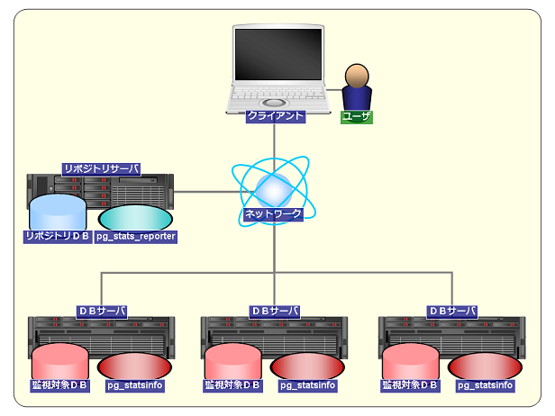
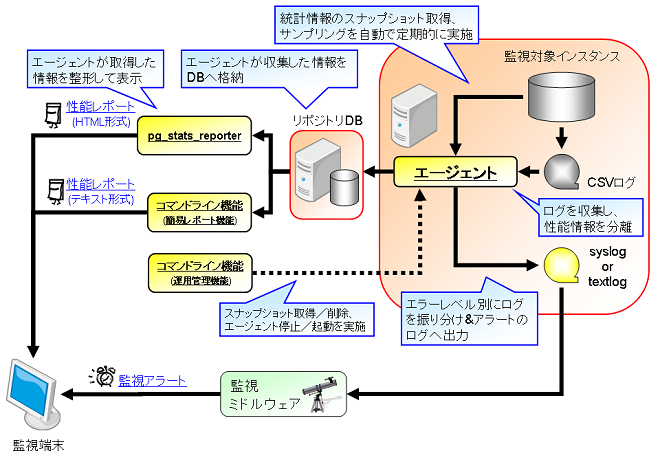

<div class="index">

1.  [pg_statsinfoとは](#pg_statsinfoとは)
2.  [機能概要](#機能概要)
    1.  [統計情報の取得機能](#統計情報の取得機能)
    2.  [サーバログ分配機能](#サーバログ分配機能)
    3.  [サーバログ蓄積機能](#サーバログ蓄積機能)
    4.  [アラート機能](#アラート機能)
    5.  [コマンドライン機能](#コマンドライン機能)
    6.  [自動メンテナンス機能](#自動メンテナンス機能)
3.  [インストール](#インストール)
    1.  [動作環境](#動作環境)
    2.  [インストール手順](#インストール手順)
4.  [使い方](#使い方)
    1.  [起動と終了](#起動と終了)
    2.  [スナップショットの取得・削除](#スナップショットの取得削除)
    3.  [サーバログの分配](#サーバログの分配)
    4.  [サーバログの蓄積](#サーバログの蓄積)
    5.  [アラート機能の設定方法](#アラート機能の設定方法)
    6.  [コマンドライン機能の使い方](#コマンドライン機能の使い方)
    7.  [自動メンテナンス機能の使い方](#自動メンテナンス機能の使い方)
    8.  [列情報とインデックス情報の取得無効化](#列情報とインデックス情報の取得無効化)
    9.  [設定ファイル](#設定ファイル)
   10.  [運用上必要となる作業](#運用上必要となる作業)
5.  [アンインストール](#アンインストール)
6.  [使用上の注意と制約](#使用上の注意と制約)
7.  [よくあるQ&A](#よくあるqa)
8.  [pg_statsinfo13からの変更点](#pg_statsinfo13からの変更点)
9.  [詳細情報](#詳細情報)
    1.  [複数の監視対象インスタンス](#複数の監視対象インスタンス)
    2.  [フォールバックモード](#フォールバックモード)
    3.  [内部構成](#内部構成)
    4.  [サーバログ分配機能内部](#サーバログ分配機能内部)
10. [関連項目](#関連項目)

</div>

# pg_statsinfo 14

## pg_statsinfoとは

PostgreSQL サーバの利用統計情報を定期的に収集・蓄積することで、DB設計やPostgreSQLの運用(日々の処理傾向の把握、
性能劣化などの兆候や問題発生時の原因の把握等)に役立つツールです。  
起動や終了、パラメータの設定は PostgreSQL と密に連携しており、手間をかけずに導入可能です。

pg_statsinfo 14 の変更点は[こちら](#pg_statsinfo13からの変更点)をご覧ください。

pg_statsinfo 14 以降は GitHub にて公開しています。pg_statsinfo 13 以前の情報については、[SourceForge](http://pgstatsinfo.sourceforge.net/index_ja.html)をご覧ください。

## 機能概要

pg_statsinfo は、PostgreSQL サーバの統計情報や活動状況を一定の時間間隔毎に定期的に収集し蓄積する機能と、
PostgreSQL の出力するサーバログを解析することでSQLの性能情報を取得する機能やログ出力を加工する機能があります。
また、蓄積した情報を元にテキスト形式のレポートを出力するコマンドを提供します。

また、pg_statsinfo で収集した情報は
[pg_stats_reporter](https://github.com/ossc-db/pg_stats_reporter)
を用いることでグラフィカルな形で解析・出力することがきます。

pg_statsinfo のシステム構成例と動作概要のイメージ図を以下に示します。

<div class="imagebox">



図1: システム構成例

</div>

<div class="imagebox">



図2: 動作概要イメージ

</div>

### 統計情報の取得機能

統計情報は一定の時間間隔で取得され、リポジトリ・データベース (以下 リポジトリDB) に保存されます。
統計情報は各インスタンスのデータベースクラスタ単位で取得できます。
リポジトリDBは、監視対象インスタンスと同一インスタンスのデータベースでも、別インスタンスでも設定可能です。
また、1つのリポジトリDBに対して複数の監視対象インスタンスの統計情報を格納することもできます。
なお 以降では pg_statsinfo で取得した統計情報を、スナップショットと定義します。

#### スナップショットの取得

スナップショットの取得方法は以下のとおりです。

  - ユーザが指定した時間間隔で定期的にスナップショットを取得することができます。デフォルト設定では10分間隔で取得します。
  - 任意のタイミングで手動でスナップショットを取得することもできます。

#### 取得できる統計情報一覧

スナップショットとして以下の統計情報を収集します。

  - [統計情報コレクタ](https://www.postgresql.jp/document/14/html/monitoring-stats.html)が収集する全ての情報。挿入
    / 更新 / 削除行数やバッファアクセス回数。
  - テーブルスペース、WAL領域、アーカイブログ領域のディスク使用量。
  - ロングトランザクション化しているクエリ。
  - バックエンドプロセスの状況。処理中、ロック待ち、トランザクション中の待機、アイドルのそれぞれで集計します。
  - トランザクションログ(WAL)の出力量や書き込みにかかった時間。
  - チェックポイントや自動バキュームの経過時間やバッファアクセス回数。
  - クエリの統計情報(実行回数、累積実行時間、累積実行計画生成時間の多いSQLと関数、OS リソース情報、待機イベント(上位10)、および実行計画)。
  - PostgreSQLの設定パラメータ。
  - OS リソース情報 (CPU使用量、メモリ使用量、ディスクI/O、ロードアベレージ)。
  - ロック競合情報
  - リカバリとの競合によるクエリのキャンセル数
  - ストリーミングレプリケーション情報 (walsenderの活動状況)
  - ロジカルレプリケーション情報 (walsenderの活動状況)
  - アラート機能で検出したアラートの内容
  - SystemTap を使用したプロファイリング情報 (実験的扱いの機能)。
  - インスタンス単位の待機イベント

スナップショットのサイズは、DB内のオブジェクト数に依存しますが、概ね1回のスナップショットで1DBあたり 800 - 1000KBを消費します。
デフォルトの取得間隔(10分間隔)の場合、監視対象インスタンス一つあたり1日で120 - 150MBを消費します。

#### リポジトリDBのテーブル構成

リポジトリDBのテーブル構成に関しては、「[pg_statsinfo v14
リポジトリDB構成](https://github.com/ossc-db/pg_statsinfo/blob/14.0/doc/files/pg_statsinfo_v14_repository_infomation.xls)」を参照してください。

### サーバログ分配機能

PostgreSQL が出力するサーバログをCSVログ、テキストログ、syslog に分配して出力します。

  - メッセージレベル (エラー種別) に応じたサーバログの分配。CSVログ、テキストログ、syslog に個別で出力閾値を設定できます。
  - テキストログのファイル名を固定。常に同じ名前 (デフォルト pg_statsinfo.log)
    で最新のサーバログを閲覧でき、ログ監視ソフトウェアとの連携が容易になります。
  - テキストログファイルのアクセス権の設定。テキストログのファイル権限を 0600 以外にも設定できるため、運用が柔軟になります。
  - テキストログ、syslog に出力されるサーバログのメッセージレベルを任意のレベルに変更可能。例えば、オペレーションミスなどで発生する
    ERROR レベルのログを INFO レベルに変更して出力できます。
  - テキストログのフィルタリング設定。特定のユーザのサーバログをテキストログに出力しないようにすることができます。

### サーバログ蓄積機能

PostgreSQL が出力するサーバログを収集し、リポジトリDBに蓄積します。

  - リポジトリDBに蓄積するサーバログを任意のメッセージレベル (エラー種別) 以上に制限することができます。
  - 特定ユーザのサーバログをリポジトリDBへ蓄積しないようにすることができます。
  - サーバログのメッセージレベルを任意のレベルに変更してリポジトリDBに蓄積することができます。

### アラート機能

監視対象インスタンスの状態を定期的 (スナップショット取得時) にチェックし、問題を検知した場合にアラートメッセージをテキストログに出力します。
アラートメッセージは、メッセージレベル "ALERT"
で出力されます。なお、アラート機能で検出したアラートの内容は、リポジトリDBにも蓄積されます。

アラート機能で判定する項目は以下のとおりです。  
監視対象インスタンス毎に、アラート機能の有効／無効とアラート条件(閾値)を設定することができます。  

  - 秒間のロールバック数
  - 秒間のコミット数
  - 監視インスタンス中の不要領域のサイズ (MB)
  - 監視インスタンス中の不要領域の割合 (%)
  - 各テーブルに占める不要領域の割合 (%)
  - クエリの平均レスポンス時間 (秒)
  - クエリの最長レスポンス時間 (秒)
  - 各テーブルの相関係数(correlation)<sup>(*1)</sup> (%)
  - バックエンドの最大数
  - テーブルスペースのディスク空き容量 (%)
  - ロードアベレージ
  - スワップ使用量 (KB)
  - レプリケーションの遅延量 (MB)

(*1) テーブルの相関係数は、クラスタ化テーブル(クラスタインデックスが存在するテーブル)を対象に判定が行われます。

各アラート項目のアラートメッセージの内容については「[pg_statsinfo v14
レポート項目一覧](https://github.com/ossc-db/pg_statsinfo/blob/14.0/doc/files/pg_statsinfo_v14_report_infomation.xls)」をご覧ください。

アラート機能の設定方法は[こちら](#アラート機能の設定方法)をご覧ください。

### コマンドライン機能

コマンドライン機能はレポート生成および運用管理を行うためのコマンドを提供します。  
※コマンドライン機能の使用方法は[こちら](#コマンドライン機能の使い方)をご覧ください。

#### 簡易レポート機能

リポジトリDBに保存されたスナップショットから任意の期間のレポートをテキスト形式で出力するコマンドを提供します。  
また、レポートの出力以外に以下の操作を行うことができます。

  - スナップショットの一覧の表示
  - スナップショットの合計サイズの表示


簡易レポート機能が出力するレポートの項目については「[pg_statsinfo v14
レポート項目一覧](https://github.com/ossc-db/pg_statsinfo/blob/14.0/doc/files/pg_statsinfo_v14_report_infomation.xls)」をご覧ください。  
なお、簡易レポート機能が出力するレポートの項目は
[pg_stats_reporter](https://github.com/ossc-db/pg_stats_reporter)
と同等です。  
グラフを用いたグラフィカルなレポートを出力したい場合は
[pg_stats_reporter](https://github.com/ossc-db/pg_stats_reporter)
を使用してください。

#### 運用管理機能

pg_statsinfo の運用管理向けの操作を行うコマンドを提供します。  
運用管理機能で行うことができる操作は以下のとおりです。

  - スナップショットの取得
  - スナップショットの削除
  - エージェントの停止
  - エージェントの起動

### 自動メンテナンス機能

1日1回、任意の時刻に下記のメンテナンス操作を行うことができます。

  - 保持期間を経過した古いスナップショットの削除
  - 保持期間を経過した蓄積ログの削除
  - サーバログのログファイルの整理

本機能はデフォルトは ON であり、上記の操作を自動メンテナンス実行時刻に実行します。

(注1)
スナップショットの自動削除が停止している場合、古いスナップショットは自動的に削除されません。必要に応じてユーザ操作で定期的に削除してください。  
(注2) 蓄積ログの自動削除が停止している場合、古いログは自動的に削除されません。必要に応じてユーザ操作で定期的に削除してください。  
(注3)
ログファイルの自動整理が停止している場合、古いログファイルは自動的には削除されません。必要に応じてユーザ操作で定期的に削除してください。

自動メンテナンス機能の使用方法は[こちら](#自動メンテナンス機能の使い方)をご覧ください。

## インストール

pg_statsinfo
のインストール方法について説明します。各インストールパッケージは[こちら](https://github.com/ossc-db/pg_statsinfo/releases)からダウンロードして下さい。

### 動作環境

  - PostgreSQL  
    バージョン 14
  - 動作検証済みOS  
    RHEL 7.x (x86_64), CentOS 7.x (x86_64)
    RHEL 8.x (x86_64), CentOS 8.x (x86_64)

### インストール手順

#### RPM

##### RHEL 7

以下はPostgreSQL14のRHEL7のx86\64用のrpmをインストールする例です。

    $ su
    # yum install pg_statsinfo-14.0-1.pg14.rhel7.x86_64.rpm

##### RHEL 8

以下はPostgreSQL14のRHEL8のx86_64用のrpmをインストールする例です。

    $ su
    # dnf install pg_statsinfo-14.0-1.pg14.rhel8.x86_64.rpm

#### source

ソースコードからビルドするには、pgxs を使用します。 なお、pg_statsinfo の登録スクリプト (sql)
を手動でインストールする必要はありません。
監視対象インスタンス、リポジトリDB共に、初回起動時に必要に応じて
エージェントがスキーマを自動的にインストールします。

    $ tar xzvf pg_statsinfo-14.0.tar.gz
    $ cd pg_statsinfo-14.0
    $ make USE_PGXS=1
    $ su
    # make USE_PGXS=1 install

pgxsを使用しない場合、contrib配下にpg_statsinfoのフォルダを配置し、make, make
installを実施してください。

contrib/pg_statsinfo.sql、contrib/pg_statsrepo.sqlは自動的にインストールされるため、手動での実行は不要です。

### 設定ファイルの概要

#### postgresql.confの設定

監視対象の PostgreSQL インスタンスを停止した状態で、postgresql.conf に以下の設定を行います。
この設定では、スナップショットの保存先は同一インスタンスの postgres
データベースになります。
これら以外の設定については、[設定ファイル](#設定ファイル)を参照して下さい。

    #最小設定
    shared_preload_libraries = 'pg_statsinfo'       # 事前ロードを行う
    log_filename = 'postgresql-%Y-%m-%d_%H%M%S.log' # ログファイル名を指定する

    #推奨設定
    shared_preload_libraries = 'pg_statsinfo'       # 事前ロードを行う
    
    pg_statsinfo.snapshot_interval = 30min          # スナップショットの取得間隔
    pg_statsinfo.enable_maintenance = 'on'          # 自動メンテナンス設定
    pg_statsinfo.maintenance_time = '00:02:00'      # 自動メンテナンス実行時刻設定
    pg_statsinfo.repolog_min_messages = disable     # ログ蓄積機能の設定
    
    log_filename = 'postgresql-%Y-%m-%d_%H%M%S.log' # ログファイル名を指定する
    log_min_messages = 'log'                        # ログへ出力するメッセージレベル。 
    pg_statsinfo.syslog_min_messages = 'error'      # syslogに出力するログレベルを指定する。
    pg_statsinfo.textlog_line_prefix = '%t %p %c-%l %x %q(%u, %d, %r, %a) '
       # pg_statsinfoがテキストログに出力する際、各行の先頭に追加される書式を指定する。log_line_prefixと同じ形式で指定する。
    pg_statsinfo.syslog_line_prefix = '%t %p %c-%l %x %q(%u, %d, %r, %a) '
       # pg_statsinfoがsyslog経由でログを出力する際、各行の先頭に追加される書式を指定する。
    
    track_functions = 'all'                         # ストアドプロシージャの呼び出しに関する統計情報を収集する
    log_checkpoints = on                            # チェックポイントを記録
    log_autovacuum_min_duration = 0                 # 自動バキュームを記録
    #pg_statsinfo.long_lock_threshold = 30s         # ロック競合情報に記録する対象の条件(閾値)を指定する

pg_statsinfo は以下の設定を強制的に上書きすることに注意してください。

  - log_destination  
    'csvlog'が追加され、'stderr'は除去されます。
  - logging_collector  
    'on' に設定されます。

  

#### pg_hba.confの設定

PostgreSQL 起動ユーザでの localhost からのアクセスではパスワードの入力が不要になるよう設定します。 この際の認証には
ident 方式を推奨します。 一般的によく利用される「OSユーザ名 = DB管理者名 =
postgres」の場合には、[pg_hba.conf](https://www.postgresql.jp/document/14/html/auth-pg-hba-conf.html)
に以下を追加します。 他の認証方式よりも優先するため、ファイルの最初のほうに書く必要があることに注意してください。 UNIX 環境では
TYPE=local の ident
    認証を使うのが手軽です。

    # TYPE  DATABASE        USER            CIDR-ADDRESS            METHOD [for UNIX]
    local   all             postgres                                ident

#### クエリの統計情報の取得設定

監視対象インスタンスの postgres データベースに
[pg_stat_statements](https://www.postgresql.jp/document/14/html/pgstatstatements.html)
をインストールすることで、クエリの統計情報もスナップショットとして収集できるようになります。  
利用する場合には、postgresql.conf の shared_preload_libraries に
pg_stat_statements を追加し、初回起動時に以下の手順で登録してください。

    $ psql -d postgres -c "CREATE EXTENSION pg_stat_statements"

また、必要に応じて設定ファイルに下記のパラメータを設定してください。

  - pg_statsinfo.stat_statements_max
  - pg_statsinfo.stat_statements_exclude_users
  - pg_stat_statements.track_planning

上記のパラメータの説明は[設定ファイル](#設定ファイル)をご覧ください。

#### クエリの実行計画の取得設定

監視対象インスタンスの postgres データベースに pg_store_plans
をインストールすることで、クエリの実行計画もスナップショットとして収集できるようになります。  
利用する場合には、postgresql.conf の shared_preload_libraries に pg_store_plans
を追加し、初回起動時に以下の手順で登録してください。

    $ psql -d postgres -c "CREATE EXTENSION pg_store_plans"

また、必要に応じて設定ファイルに下記のパラメータを設定してください。

  - pg_statsinfo.stat_statements_max
  - pg_statsinfo.stat_statements_exclude_users

上記のパラメータの説明は[設定ファイル](#設定ファイル)をご覧ください。

(注1) pg_stats_reporter を利用する場合は、リポジトリDBにも pg_store_plans
をインストールする必要があります。  
なお、リポジトリDBへのインストールの際は上記の shared_preload_libraries の設定は不要です。

以上でインストールは終了です。

## 使い方

pg_statsinfo の操作方法と各種設定について説明します。

### 起動と終了

起動は、通常どおりPostgreSQLを起動するだけです。 PostgreSQL の起動と連動して エージェントが自動的に起動します。
エージェント単体で起動することはできません。

    $ pg_ctl start [OPTIONS]

終了も同様に、PostgresSQL サーバの終了に連動します。 smart 以外の終了モード (fast, immediate)
ではサーバログにエラーが出力される場合がありますが、正常な動作です。

    $ pg_ctl stop -m smart [OPTIONS]

また、PostgreSQL サーバを終了せずに エージェントのみを停止するには以下のコマンドを実行します。

    $ pg_statsinfo --stop [OPTIONS]

停止中のエージェントを起動するには以下のコマンドを実行します。

    $ pg_statsinfo --start [OPTIONS]

**(注1) PostgreSQLの設定パラメータに「shared_preload_libraries =
'pg_statsinfo'」が設定されていない場合は、エージェントの停止／起動が実行できません。**

### スナップショットの取得・削除

#### 自動取得

スナップショットを一定の時間間隔で定期的に取得します。postgresql.confに以下の設定を記述することで自動取得を実行できます。

例: スナップショットの取得間隔を30分に設定する。

    pg_statsinfo.snapshot_interval = 30min 

#### 手動取得

任意のタイミングでスナップショットを取得する場合は、監視対象のインスタンスが存在するDBクラスタのpostgresデータベースに対し、関数
statsinfo.snapshot(text DEFAULT NULL) を実行して下さい。  
引数でスナップショット取得理由をコメントとして記録できます。

例: 手動でスナップショットを取得します。コメントとして文字列 'comment' を付与します。

    $ psql -d postgres -c "SELECT statsinfo.snapshot('comment')"

なお、手動取得は非同期で行われます。上記のコマンド完了時にスナップショット取得が完了していない場合があります。

#### 自動削除

自動メンテナンス機能を使用することで保持期間を経過したスナップショット削除を自動的に削除することができます。  
自動メンテナンスのスナップショット削除はデフォルトが ON となっています。

自動メンテナンス機能の使い方は[こちら](#自動メンテナンス機能の使い方)をご覧ください。

#### 手動削除

スナップショットの手動削除は監視対象インスタンスに対して、関数 statsinfo.maintenance(timestamptz)
を実行して下さい。 引数で指定した時刻より古いスナップショットが削除されます。

例: 取得日時が 2011-02-01 07:00:00
    より古いスナップショットを削除します。

    $ psql -d postgres -c "SELECT statsinfo.maintenance('2010-02-01 07:00:00'::timestamptz);"

なお、手動削除は非同期で行われます。上記のコマンド完了時にスナップショット削除が完了していない場合があります。

### サーバログの分配

pg_statsinfo には PostgreSQL のサーバログをフィルタリングにより加工する機能があります。  
以下では、出力されるログファイルの種類とフィルタリングの種類を説明します。

#### ログファイルの種類

  - CSVログ (*.csv) (例: postgresql-2013-10-01_000000.csv)  
    CSVログとは、PostgreSQL
    が出力する生のログとなります。(CSVログの詳細は[こちら](https://www.postgresql.jp/document/14/html/runtime-config-logging.html#RUNTIME-CONFIG-LOGGING-CSVLOG)をご覧ください)
    pg_statsinfo は本ログの情報を元に加工したログの出力を行いますが、本ログに関しては全く加工を行いません。
  - テキストログ (pg_statsinfo.log)  
    テキストログとは、PostgreSQL が出力したログ(CSVログ)の情報を元に pg_statsinfo
    が加工を行ったログです。
    テキストログには以下の特徴があります。
      - テキストログの書式を任意の形式に設定することができます。
      - テキストログのファイルアクセス権限を設定することができます。
      - テキストログのファイル名を設定することができます。
      - 特定のユーザのログを除外した内容で出力することができます。
      - 特定のSQLSTATEを持つログのメッセージレベルを変更した内容で出力することができます。
    テキストログの書式、ファイル名およびファイルアクセス権限は、設定ファイルの下記のパラメータで指定します。(詳細は[こちら](#設定ファイル)をご覧ください)
      - pg_statsinfo.textlog_line_prefix
      - pg_statsinfo.textlog_permission
      - pg_statsinfo.textlog_filename
  - 保存用テキストログ (例: postgresql-2013-10-01_000000.log)  
    上記のテキストログをlog_filenameで定義された名前にリネームしたファイルです。ログローテート等の際に生成されます。

(注1) ログローテート前に将来リネーム予定のパスに既にファイルが存在する場合がありますが、これは正常な状態です。  
(注2)
拡張子が「.copy」、「.err.*n*」のファイルが作成される場合があります。当該ファイルの詳細は[こちら](#サーバログ分配機能内部)を参照してください。

ログファイルの出力例を以下に示します。

    $ ls -l $PGDATA/log
    -rw------- 1 postgres postgres 433644 Oct  1 23:59 postgresql-2013-10-01_000000.csv
    -rw------- 1 postgres postgres 322167 Oct  1 23:59 postgresql-2013-10-01_000000.log
    -rw------- 1 postgres postgres 425449 Oct  2 23:59 postgresql-2013-10-02_000000.csv
    -rw------- 1 postgres postgres 321695 Oct  2 23:59 postgresql-2013-10-02_000000.log
    -rw------- 1 postgres postgres 255424 Oct  3 13:40 postgresql-2013-10-03_000000.csv
    -rw------- 1 postgres postgres      0 Oct  3 00:00 postgresql-2013-10-03_000000.log
    -rw------- 1 postgres postgres 190786 Oct  3 13:40 pg_statsinfo.log
    
    postgresql-2013-10-01_000000.csv ... ログローテート済みのCSVログ
    postgresql-2013-10-01_000000.log ... ログローテート済みのテキストログ (上記のCSVログの情報を元に加工したログ)
    postgresql-2013-10-02_000000.csv ... ログローテート済みのCSVログ
    postgresql-2013-10-02_000000.log ... ログローテート済みのテキストログ (上記のCSVログの情報を元に加工したログ)
    postgresql-2013-10-03_000000.csv ... 最新のCSVログ
    postgresql-2013-10-03_000000.log ... コンソールログ
    pg_statsinfo.log ................... テキストログ (最新のCSVログの情報を元に加工したログ)

#### フィルタリングの種類

  - メッセージレベルによる出力制御  
    特定のメッセージレベルより低いレベルのログをテキストログに出力しないようにフィルタリングします。
    特定のメッセージレベルは、設定ファイル(postgresql.conf)の下記のパラメータで指定します。
    設定の詳細については、[設定ファイル](#設定ファイル)をご覧ください。
      - pg_statsinfo.textlog_min_messages
    設定例: warning 以上のメッセージレベルのログをテキストログに出力する
        pg_statsinfo.textlog_min_messages = warning
  - 特定ユーザのセッションのログの出力制御  
    特定ユーザのセッションのログをテキストログに出力しないようにフィルタリングします。
    特定ユーザは、設定ファイル(postgresql.conf)の下記のパラメータで指定します。
    設定の詳細については、[設定ファイル](#設定ファイル)をご覧ください。
      - pg_statsinfo.textlog_nologging_users
    設定例: postgres
    ユーザのセッションのログをテキストログに出力しない
        pg_statsinfo.textlog_nologging_users = 'postgres'
  - メッセージレベルの変更  
    特定のSQLSTATEを持つログのメッセージレベルを任意のメッセージレベルに変更します。
    メッセージレベルの変更対象のSQLSTATEおよび変更後のメッセージレベルは、設定ファイル(postgresql.conf)の下記のパラメータで指定します。
    設定の詳細については、[設定ファイル](#設定ファイル)をご覧ください。
      - pg_statsinfo.adjust_log_level
      - pg_statsinfo.adjust_log_info
      - pg_statsinfo.adjust_log_notice
      - pg_statsinfo.adjust_log_warning
      - pg_statsinfo.adjust_log_error
      - pg_statsinfo.adjust_log_log
      - pg_statsinfo.adjust_log_fatal
    設定例: SQLSTATEが '42P01' のログのメッセージレベルを 'INFO' に変更する
        pg_statsinfo.adjust_log_level = on
        pg_statsinfo.adjust_log_info = '42P01'

(注1) メッセージレベルの変更は、サーバログ分配とサーバログ蓄積で共通です。  
(注2) メッセージレベルの変更をサーバログ分配とサーバログ蓄積で個別に設定することはできません。

#### 自動メンテナンス機能によるログファイル整理

自動メンテナンス機能を使用することでログファイルの整理を行うことができます。  
自動メンテナンスのログファイル整理はデフォルトが ON となっています。

自動メンテナンス機能の使い方は[こちら](#自動メンテナンス機能の使い方)をご覧ください。

### サーバログの蓄積

サーバログ蓄積機能を使用することで PostgreSQL のサーバログをリポジトリDBに蓄積することができます。  
また、リポジトリDBに蓄積するサーバログをフィルタリングすることが可能です。

#### フィルタリングの種類

  - メッセージレベルによる蓄積制限  
    特定のメッセージレベルより低いレベルのログを蓄積しないように制限します。
    制限するメッセージレベルは、設定ファイル(postgresql.conf)の下記のパラメータで指定します。
    設定の詳細については、[設定ファイル](#設定ファイル)をご覧ください。
      - pg_statsinfo.repolog_min_messages
    設定例: warning 以上のメッセージレベルのログを蓄積する
        pg_statsinfo.repolog_min_messages = warning
    なお、当該パラメータに "disable" を指定することでサーバログの蓄積を無効化することができます。
    設定例: サーバログの蓄積を無効化する
        pg_statsinfo.repolog_min_messages = disable
  - 特定ユーザのログの蓄積制限  
    特定ユーザのセッションのログを蓄積しないように制限します。
    特定ユーザは、設定ファイル(postgresql.conf)の下記のパラメータで指定します。
    設定の詳細については、[設定ファイル](#設定ファイル)をご覧ください。
      - pg_statsinfo.repolog_nologging_users
    設定例: postgres ユーザのセッションのログを蓄積しない
        pg_statsinfo.repolog_nologging_users = 'postgres'
  - メッセージレベルの変更  
    特定のSQLSTATEを持つログのメッセージレベルを任意のメッセージレベルに変更します。
    メッセージレベルの変更は、サーバログ分配とサーバログ蓄積で共通です。
    メッセージレベルの変更をサーバログ分配とサーバログ蓄積で個別に設定することはできません。
    メッセージレベルの変更の設定手順は [こちら](#adjust-log-level) をご覧ください。

#### 自動メンテナンス機能による蓄積ログの削除

自動メンテナンス機能を使用することでリポジトリDBに蓄積されたログを定期的に削除することができます。  
自動メンテナンスの蓄積ログの削除はデフォルトが ON となっています。

自動メンテナンス機能の使い方は[こちら](#自動メンテナンス機能の使い方)をご覧ください。

#### 再帰的なサーバログ蓄積の防止

以下の条件をすべて満たす場合は、サーバログ蓄積が再帰的に繰り返されてしまいます。  
これを防ぐためにサーバログ蓄積を強制的に無効化します。

  - 監視対象DBとリポジトリDBが同一インスタンスの構成である
  - リポジトリDBへの接続に使用するユーザがスーパユーザではない
  - リポジトリDB接続の設定パラメータ「log_statements」が "all" または "mod" に設定されている  
    ※log_statements は設定ファイル(postgresql.conf)のほかに、ロール固有の設定があることに注意してください

### アラート機能の設定方法

アラート条件(閾値)は、アラート設定テーブル(リポジトリDBの「statsrepo.alert」テーブル)で管理します。  
各設定カラムの値を -1
に設定することで項目単位でアラートを無効にできます。

アラート設定テーブルのスキーマ構成を以下に示します。

| カラム名                    | データ型    | デフォルト値  | 説明                                     |
| ----------------------- | ------- | ------- | -------------------------------------- |
| instid                  | bigint  | －       | 監視対象インスタンスID                           |
| rollback_tps           | bigint  | 100     | 秒間のロールバック数                             |
| commit_tps             | bigint  | 1000    | 秒間のコミット数                               |
| garbage_size           | bigint  | \-1     | 監視インスタンス中の不要領域のサイズ(MB)                 |
| garbage_percent        | integer | 30      | 監視インスタンスに占める不要領域の割合(%)                 |
| garbage_percent_table | integer | 30      | 各テーブルに占める不要領域の割合(%)                    |
| response_avg           | bigint  | 10      | クエリの平均レスポンス時間(秒)                       |
| response_worst         | bigint  | 60      | クエリの最長レスポンス時間(秒)                       |
| correlation_percent    | integer | 70      | 各テーブルの相関係数(correlation)(%)             |
| backend_max            | integer | 100     | バックエンドの最大数                             |
| disk_remain_percent   | integer | 20      | テーブルスペースのディスク空き容量の割合(%)                |
| loadavg_1min           | real    | 7.0     | 過去1分間のロードアベレージ                         |
| loadavg_5min           | real    | 6.0     | 過去5分間のロードアベレージ                         |
| loadavg_15min          | real    | 5.0     | 過去15分間のロードアベレージ                        |
| swap_size              | integer | 1000000 | スワップ使用量(KB)                            |
| rep_flush_delay       | integer | 100     | マスタとスタンバイ間のWAL書き込み遅延量(MB)              |
| rep_replay_delay      | integer | 200     | スタンバイのリカバリ遅延量(MB)                      |
| enable_alert           | boolean | true    | false に設定するとこのインスタンスについてのアラートが無効になります。 |

設定変更の例:
秒間ロールバック数の閾値を「3000」に変更する場合

    # UPDATE statsrepo.alert SET rollback_tps = 3000 WHERE instid = <変更対象の監視対象インスタンスID>

このテーブルの行を削除すると、該当する監視対象インスタンスのアラート機能が無効になります。このアラートを有効にするためには新たな行を挿入する必要があります。

#### アラート機能の有効化

[GUC 設定ファイル](#設定ファイル)の pg_statsinfo.enable_alert を true
にすることでアラート機能全体を有効にできます。監視対象インスタンス単位での有効化・無効化はアラート設定テーブルの
enable_alert カラムで行います。デフォルト値はpg_statsinfo.enable_alertはfalse、アラート設定テーブルのenable_alert カラムはtrueです。そのためデフォルトではアラートは無効になっています。

### コマンドライン機能の使い方

#### レポート生成

    $ pg_statsinfo -r REPORTID [-i INSTANCEID] [-b SNAPID] [-e SNAPID] [-B DATE] [-E DATE] [-o FILENAME] [connection-options]

以下にコマンド例を示します。  
以下のコマンド例では、ホスト名 localhost 上のポート 5432 で稼動しているリポジトリDBに対して、postgres
データベースに、postgres ユーザで接続し、以下の条件のレポートを出力します。

  - レポート種別IDが All のレポート
  - レポート範囲は最初のスナップショットから最後のスナップショット
  - レポート対象は全ての監視対象インスタンス
  - レポートの出力先は標準出力

<!-- end list -->

    $ pg_statsinfo  -r All -h localhost -d postgres -p 5432 -U postgres

  - -r, --report=REPORTID  
    レポート種別IDを指定します。
    レポート種別IDに指定できる値は以下のとおりです。
    レポート種別IDとレポートの内容についての対応は「[pg_statsinfo v14
    レポート項目一覧](https://github.com/ossc-db/pg_statsinfo/blob/14.0/doc/files/pg_statsinfo_v14_report_infomation.xls)」をご覧ください。
      - Summary
      - Alert
      - DatabaseStatistics
      - InstanceActivity
      - OSResourceUsage
      - DiskUsage
      - LongTransactions
      - NotableTables
      - CheckpointActivity
      - AutovacuumActivity
      - QueryActivity
      - LockConflicts
      - ReplicationActivity
      - SettingParameters
      - SchemaInformation
      - Profiles
      - All
    レポート種別IDは、頭文字からの最短一致での指定を許容し、大文字と小文字を区別しません。
  - \-i, --instid=INSTANCEID  
    レポート対象とする監視対象インスタンスの識別子を指定します。
    本オプションは省略可能です。省略時は全ての監視対象インスタンスがレポート対象です。
  - -b, --beginid=SNAPID  
    レポート範囲の開始点とするスナップショットをスナップショットIDで指定します。
    本オプションは省略可能です。省略時は最初のスナップショットを開始点とします。
    本オプションと「--B, --begindate」または「-E, --enddate」を同時に指定することはできません。
  - \-e, --endid=SNAPID  
    レポート範囲の終了点とするスナップショットをスナップショットIDで指定します。
    本オプションは省略可能です。省略時は最後のスナップショットを終了点とします。
    本オプションと「--B, --begindate」または「-E, --enddate」を同時に指定することはできません。
  - \-B, --begindate=DATE  
    レポート範囲の開始点とするスナップショットを日時 (YYYY-MM-DD HH:MI:SS形式) で指定します。
    本オプションは省略可能です。省略時は最初のスナップショットを開始点とします。
    本オプションと「--b, --beginid」または「-e, --endid」を同時に指定することはできません。
  - \-E, --enddate=DATE  
    レポート範囲の終了点とするスナップショットを日時 (YYYY-MM-DD HH:MI:SS形式) で指定します。
    本オプションは省略可能です。省略時は最後のスナップショットを終了点とします。
    本オプションと「--b, --beginid」または「-e, --endid」を同時に指定することはできません。
  - \-o, --output=FILENAME  
    レポートの出力先ファイル名を指定します。
    本オプションは省略可能です。省略時はレポートを標準出力に出力します。
    指定したファイルが既に存在する場合は上書きします。

  

#### スナップショット一覧表示

    $ pg_statsinfo -l [-i INSTANCEID] [connection-options]

以下にコマンド例を示します。  
以下のコマンド例では、ホスト名 localhost 上のポート 5432 で稼動しているリポジトリDBに対して、postgres
データベースに、postgres
ユーザで接続し、当該リポジトリDBに蓄積されているスナップショットの一覧を表示します。

    $ pg_statsinfo -l -h localhost -d postgres -p 5432 -U postgres

  - \-l, --list  
    本オプションが指定された場合はスナップショット一覧の表示を行います。
  - \-i, --instid=INSTANCEID  
    スナップショット一覧を表示する監視対象インスタンスの識別子を指定します。
    本オプションは省略可能です。省略時は全ての監視対象インスタンスのスナップショット一覧を表示します。

  

#### スナップショットサイズ表示

    $ pg_statsinfo -s [connection-options]

以下にコマンド例を示します。  
以下のコマンド例では、ホスト名 localhost 上のポート 5432 で稼動しているリポジトリDBに対して、postgres
データベースに、postgres
ユーザで接続し、当該リポジトリDBに蓄積されているスナップショットのサイズを表示します。

    $ pg_statsinfo -s -h localhost -d postgres -p 5432 -U postgres

  - \-s, --size  
    本オプションが指定された場合はスナップショットサイズの表示を行います。

  

#### スナップショット取得

    $ pg_statsinfo -S COMMENT [connection-options]

以下にコマンド例を示します。  
以下のコマンド例では、ホスト名 localhost 上のポート 5432 で稼動している監視対象インスタンスに対して、postgres
データベースに、postgres
    ユーザで接続し、'COMMENT'をコメントとして付与したスナップショットを取得します。

    $ pg_statsinfo -S 'COMMENT' -h localhost -d postgres -p 5432 -U postgres

  - \-S, --snapshot=COMMENT  
    本オプションが指定された場合はスナップショットの取得を行います。
    オプション引数にはスナップショットに付与するコメントを指定します。

  

#### スナップショット削除

    $ pg_statsinfo -D SNAPID [connection-options]

以下にコマンド例を示します。  
以下のコマンド例では、ホスト名 localhost 上のポート 5432 で稼動しているリポジトリDBに対して、postgres
データベースに、postgres ユーザで接続し、当該リポジトリDBに蓄積されているスナップショットIDが
123 のスナップショットを削除します。

    $ pg_statsinfo -D 123 -h localhost -d postgres -p 5432 -U postgres

  - \-D, --delete=SNAPID  
    本オプションが指定された場合はスナップショットの削除を行います。
    オプション引数には削除対象のスナップショットのスナップショットIDを指定します。

  

#### エージェント停止

    $ pg_statsinfo --stop [connection-options]

以下にコマンド例を示します。  
以下のコマンド例では、ホスト名 localhost 上のポート 5432 で稼動している監視対象インスタンスに対して、postgres
データベースに、postgres ユーザで接続し、エージェントを停止します。

    $ pg_statsinfo --stop -h localhost -d postgres -p 5432 -U postgres

  - \--stop  
    本オプションが指定された場合は エージェントを停止します。

  

#### エージェント起動

    $ pg_statsinfo --start [connection-options]

以下にコマンド例を示します。  
以下のコマンド例では、ホスト名 localhost 上のポート 5432 で稼動している監視対象インスタンスに対して、postgres
データベースに、postgres ユーザで接続し、エージェントを起動します。

    $ pg_statsinfo --start -h localhost -d postgres -p 5432 -U postgres

  - \--start  
    本オプションが指定された場合は エージェントを起動します。

  

#### 共通オプション (connection-options)

データベース接続に関するオプションです。  
スナップショット取得を実行する場合は監視対象インスタンス、それ以外はリポジトリDBへの接続情報を指定します。

  - \-d, --dbname=DBNAME  
    接続するデータベース名を指定します。
    本オプションが指定されていない場合は環境変数「PGDATABASE」の値が使用されます。
    環境変数も設定されていない場合は、接続時に指定したユーザ名が使用されます。
  - \-h, --host=HOSTNAME  
    サーバが稼働しているマシンのホスト名を指定します。
    ホスト名がスラッシュから始まる場合、Unixドメインソケット用のディレクトリとして使用されます。
  - \-p, --port=PORT  
    サーバが接続を監視するTCPポートもしくはUnixドメインソケットファイルの拡張子を指定します。
  - \-U, --username=USERNAME  
    接続するユーザ名を指定します。
  - \-w,
    --no-password  
    パスワードの入力を促しません。サーバがパスワード認証を必要とし、かつ、.pgpassファイルなどの他の方法が利用できない場合、接続試行は失敗します。
  - \-W, --password  
    データベースに接続する前に、強制的にパスワード入力を促します。

  

### 自動メンテナンス機能の使い方

自動メンテナンス機能を使用することで以下の操作を1日1回任意の時刻に行うことができます。

  - 保持期間を経過した古いスナップショットの削除
  - 保持期間を経過した蓄積ログの削除
  - サーバログのログファイルの整理

自動メンテナンス機能を使用するには、設定ファイル(postgresql.conf)に以下のパラメータを指定します。  
設定の詳細については、[設定ファイル](#設定ファイル)をご覧ください。

  - pg_statsinfo.enable_maintenance
  - pg_statsinfo.maintenance_time
  - pg_statsinfo.repository_keepday
  - pg_statsinfo.repolog_keepday
  - pg_statsinfo.log_maintenance_command

設定例1: 毎日0時2分に7日間の保持期間を過ぎたスナップショットを自動削除する

    pg_statsinfo.enable_maintenance = 'snapshot' # 自動メンテナンス設定
    pg_statsinfo.maintenance_time = '00:02:00'   # 自動メンテナンス実行時刻設定
    pg_statsinfo.repository_keepday = 7          # スナップショットの保持期間設定

設定例2: 毎日0時2分に7日間の保持期間を過ぎた蓄積ログを自動削除する

    pg_statsinfo.enable_maintenance = 'repolog' # 自動メンテナンス設定
    pg_statsinfo.maintenance_time = '00:02:00'  # 自動メンテナンス実行時刻設定
    pg_statsinfo.repolog_keepday = 7            # 蓄積ログの保持期間設定

設定例3: 毎日0時2分に前日以前のCSVログファイルを圧縮アーカイブする

    pg_statsinfo.enable_maintenance = 'log'    # 自動メンテナンス設定
    pg_statsinfo.maintenance_time = '00:02:00' # 自動メンテナンス実行時刻設定
    pg_statsinfo.log_maintenance_command = '<PGHOME>/bin/archive_pglog.sh %l' # ログファイル整理コマンド設定 (*1)
    ※<PGHOME>: PostgreSQL インストールディレクトリ
    
    (*1) archive_pglog.sh
    archive_pglog.sh は同梱されるシェルスクリプトです。
    前日以前のCSVログファイルを圧縮アーカイブし、ログファイル格納ディレクトリ配下にアーカイブファイル(TGZ)を作成します。
    また、アーカイブしたCSVログファイルをログファイル格納ディレクトリから削除します。

設定例4: 毎日0時2分に7日間の保持期間を過ぎたスナップショットと蓄積ログを自動削除、かつ前日以前のCSVログファイルを圧縮アーカイブする

    pg_statsinfo.enable_maintenance = 'on'     # 自動メンテナンス設定
    pg_statsinfo.maintenance_time = '00:02:00' # 自動メンテナンス実行時刻設定
    pg_statsinfo.repository_keepday = 7        # スナップショットの保持期間設定
    pg_statsinfo.repolog_keepday = 7           # 蓄積ログの保持期間設定
    pg_statsinfo.log_maintenance_command = '<PGHOME>/bin/archive_pglog.sh %l' # ログファイル整理コマンド設定

(注1) 自動メンテナンス設定のデフォルトは、全ての操作を実行する設定('on')です。

(注2) 自動メンテナンスでスナップショット削除や蓄積ログ削除を行わない場合、手動で削除しない限りリポジトリDBに残り続けます。
不要となった古いスナップショットおよび蓄積ログは定期的に削除して下さい。

(注3) ログファイル整理コマンドの設定を省略した場合、上記の例と同じコマンドが適用されます。

(注4) 複数監視対象インスタンス－単一リポジトリDBの構成で、各監視対象インスタンスのスナップショットの保持期間を
互いに異なる期間に設定した場合、自動メンテナンス実行時には最も短く設定した期間のスナップショットが保持されます。
例えば、各監視対象インスタンスの設定ファイル(postgresql.conf)を以下のように設定した場合は、
過去3日間のスナップショットが保持されることになります。(蓄積ログに関しても同様)

    <監視対象インスタンス1>
    pg_statsinfo.enable_maintenance = 'on'
    pg_statsinfo.repository_keepday = 7
    <監視対象インスタンス2>
    pg_statsinfo.enable_maintenance = 'on'
    pg_statsinfo.repository_keepday = 5
    <監視対象インスタンス3>
    pg_statsinfo.enable_maintenance = 'on'
    pg_statsinfo.repository_keepday = 3

### 列情報とインデックス情報の取得無効化

非常に多くのテーブルやインデックスを持つ環境では、スナップショットサイズの肥大化や、取得時間の遅延が問題となる場合があります。情報収集対象を制限することで、スナップショットサイズおよび取得時間の削減が可能です。

pg_statsinfoでは、特にテーブルの列情報とインデックス情報がスナップショットサイズの多くを占めることが多いため、列情報とインデックス情報の取得を無効化するパラメータを持っています。列情報取得の有効/無効はpg_statsinfo.collect_column、インデックス情報取得の有効/無効はpg_statsinfo.collect_indexでそれぞれ設定します。どちらもon/off、もしくはtrue/falseでの指定となり、デフォルトは双方ともonです。

ただし、一部レポート項目が出力されなくなります。これらの情報が不要であると判断できた場合のみ、利用するようにしてください。詳細は[設定ファイルの注記](#設定ファイル:レポート不可となる項目)をご覧ください。

#### 削減サイズの目安

1回のスナップショットで、情報収集対象となるインデックス1つあたり約350Byte、列1つあたり約150Byteが必要となるため、収集しない場合はこれらがそのまま削減できます。ただし、インデックス名や列名が非常に長い場合や、インデックスに対してreloptionsを多数設定している場合、1つあたりのサイズはこれより大きくなるケースもあります。

列数はテーブル数やインデックス数よりも多くなることがほとんどであるため、スナップショットサイズにおいても支配的な要素となりやすいです。以下の例では、スナップショットサイズのうち50%以上が列情報となっています。

| スキーマ条件 | スナップショットサイズ | スナップショットサイズ(インデックス部分) | スナップショットサイズ(列部分) |
|-------------|----------------------|-------------------------------------|---------------------| 
| テーブル数 1000、インデックス数 1000、カラム数 10000(1テーブルあたり10カラム) | 2.8MB | 0.34MB | 1.5MB |
| テーブル数 10000、インデックス数 10000、カラム数 100000(1テーブルあたり10カラム) | 26MB | 3.3MB | 14.2MB |

### 設定ファイル

pg_statsinfo は設定ファイルとして監視対象インスタンスの postgresql.conf を使用します。
設定ファイルに記載した内容は、インスタンス起動時とリロード時 (pg_ctl
reload) に読み込まれ、動作に反映されます。

#### 必須設定項目

pg_statsinfo を利用するために必須のパラメータは以下です。 パラメータを後から変更するためには PostgreSQL
インスタンスの再起動が必要な設定もあります。

| 設定項目                       | 設定値                                      | 説明                                                                                                                                                                           |
| -------------------------- | ---------------------------------------- | ---------------------------------------------------------------------------------------------------------------------------------------------------------------------------- |
| shared_preload_libraries | 'pg_statsinfo'                          | 事前読込み用のライブラリの指定。 pg_stat_statements、pg_store_plans を併用する場合は 'pg_stat_statements, pg_store_plans, pg_statsinfo, ' のようにカンマ区切りで指定します。                                    |
| lc_messages               | C                                        | PostgreSQLが出力するサーバログの言語を指定。pg_statsinfo がサーバログの解析をするために必要な設定です。                                                                                                       |
| log_filename              | 'postgresql-%Y-%m-%d_%H%M%S.log'        | CSVログおよびテキストログのファイル名。デフォルトから変更する場合でも、%Y, %m, %d, %H, %M, %S がこの順に全て表れる形式でなければなりません。                                                                                          |
| track_counts              | on                                       | データベースの活動に関する統計情報の収集設定。                                                                                                                                                      |
| track_activities          | on                                       | セッションで実行中のコマンドに関する情報の収集設定。                                                                                                                                                   |
| log_min_messages         | debug5 ~ log                             | ログへ出力するメッセージレベル。 'log', pg_statsinfo.syslog_min_messages, pg_statsinfo.textlog_min_messages, pg_statsinfo.repolog_min_messages のいずれの設定よりも、より多くを出力するレベルを設定する必要があります。 |
| log_destination           | 'csvlog' 必須 / 'syslog', 'eventlog' を追加可能 | 他の値であっても、エージェント起動時に強制的に 'csvlog' が追加され、'stderr' は除去されます。                                                                                                                     |
| logging_collector         | on                                       | 他の値であっても、エージェント起動時に強制的にこの値に設定されます。                                                                                                                                           |

  

#### 追加設定項目

pg_statsinfo を利用するために確認が推奨されるパラメータは以下です。 パラメータを後から変更するためには、設定値のリロード
(pg_ctl reload) 、もしくはインスタンスの再起動(pg_ctl restart)が必要です。再起動が必要なものは以下の説明の項に記載しています。


| 設定項目                                         | デフォルト値                                     | 説明                                                                                                                                                                                              |
|----------------------------------------------|--------------------------------------------|-------------------------------------------------------------------------------------------------------------------------------------------------------------------------------------------------|
| track_functions                              | none                                       | 関数の呼び出しに関する統計情報の収集設定。 統計情報を収集するためには pl または all を設定します。                                                                                                                                          |
| track_io_timing                              | off                                        | ブロックの読み込みと書き込み時間に関する統計情報の収集設定。 ブロックの読み書きに関する統計情報を収集する場合は on を設定します。 <br> 本パラメータを on に設定した場合、現時点の時刻をオペレーティングシステムに繰り返し問い合わせるので、プラットフォームによっては深刻な負荷の原因になる可能性がある点を留意してください。 |
| log_checkpoints                              | off                                        | チェックポイント状況のサーバログ出力。on を推奨します。                                                                                                                                                                   |
| log_autovacuum_min_duration                  | -1                                         | 自動バキューム状況のサーバログ出力。0 ~ 1min を推奨します。                                                                                                                                                              |
| log_directory                                | 'log'                                      | CSVログおよびテキストログの出力先ディレクトリ。                                                                                                                                                                       |
| log_rotation_age                             | 1d                                         | ログローテート設定 (期間によるログファイル切替)。                                                                                                                                                                      |
| log_rotation_size                            | 10MB                                       | ログローテート設定 (容量によるログファイル切替)。                                                                                                                                                                      |
| syslog_facility                              | 'LOCAL0'                                   | syslog の facility 指定。                                                                                                                                                                           |
| syslog_ident                                 | 'postgres'                                 | syslog の indent文字列指定。                                                                                                                                                                           |
| pg_stat_statements.track_planning            | off                                        | クエリの統計情報で"実行計画生成時間"を取得する場合は on を設定します。                                                                                                                                                          |
| pg_stat_statements.save                      | on                                         | クエリの実行時の統計情報をPostgreSQLの停止・起動をまたがって記録しておくかを設定します。|
| pg_store_plans.save                          | on                                         | 実行計画の統計情報をPostgreSQLの停止・起動をまたがって記録しておくかを設定します。|
| pg_statsinfo.textlog_min_messages            | warning                                    | テキストログへ出力する最小メッセージレベル [(*1)](#1_設定ファイル_メッセージレベル)                                                                                                                                                                     |
| pg_statsinfo.syslog_min_messages             | disable                                    | syslog へ出力する最小メッセージレベル [(*1)](#1_設定ファイル_メッセージレベル)                                                                                                                                                                    |
| pg_statsinfo.textlog_filename                | 'pg_statsinfo.log'                         | テキストログファイル名。空文字はエラー。                                                                                                                                                                            |
| pg_statsinfo.textlog_line_prefix             | '%t %p '                                   | テキストログの各行の先頭に追加される書式 [(*2)](#2_設定ファイル_書式指定)                                                                                                                                                                       |
| pg_statsinfo.syslog_line_prefix              | '%t %p '                                   | syslog の各行の先頭に追加される書式 [(*2)](#2_設定ファイル_書式指定). syslog がデフォルトで付与する時刻とプロセスIDは、エージェントのものに置き換わってしまうため、元の値を記録するために %t や %p が必要なことに注意してください。                                                                             |
| pg_statsinfo.textlog_permission              | 0600                                       | テキストログファイルのパーミッション指定。通常使われる8進数形式を使用するのであれば、0（ゼロ）で始まらなければなりません。                                                                      |
| pg_statsinfo.textlog_nologging_users         | -                                          | テキストログのフィルタリング設定。テキストログへの出力を除外するユーザを設定します。複数のユーザを設定する場合はカンマ区切りで指定します。                                                                                                                           |
| pg_statsinfo.repolog_min_messages            | warning                                    | リポジトリDBに蓄積するサーバログの最小メッセージレベル。[(*1)](#1_設定ファイル_メッセージレベル) <br> 監視対象DBとリポジトリDBが同一インスタンスの場合には disable (無効)にすることを推奨します |
| pg_statsinfo.repolog_nologging_users         | -                                          | サーバログ蓄積のフィルタリング設定。リポジトリDBへの蓄積を除外するユーザを設定します。複数のユーザを設定する場合はカンマ区切りで指定します。                                                                                                                         |
| pg_statsinfo.repolog_buffer                  | 10000                                      | サーバログ蓄積機能のチューニング設定。バッファリングするログレコード数を指定します。                                                                                                                                                      |
| pg_statsinfo.repolog_interval                | 10s                                        | サーバログ蓄積機能のチューニング設定。バッファ内のログをリポジトリDBへ格納する間隔を指定します。[(*3)](#3_設定ファイル_時間指定)                                                                                                                                           |
| pg_statsinfo.sampling_interval               | 5s                                         | サンプリングの実行間隔 [(*3)](#3_設定ファイル_時間指定)                                                                                                                                                                                |
| pg_statsinfo.snapshot_interval               | 10min                                      | スナップショットの取得間隔 [(*3)](#3_設定ファイル_時間指定)                                                                                                                                                                              |
| pg_statsinfo.excluded_dbnames                | 'template0, template1'                     | 監視対象から除外するデータベース名。                                                                                                                                                                              |
| pg_statsinfo.excluded_schemas                | 'pg_catalog, pg_toast, information_schema' | 監視対象から除外するスキーマ名。                                                                                                                                                                                |
| pg_statsinfo.repository_server               | 'dbname=postgres'                          | リポジトリDBへの接続文字列 [(*4)](#4_設定ファイル_接続文字列)。パスワードの入力待ちは避ける。一般ユーザを使用して接続する場合は、 こちら の注意点をご覧ください。                                                                                                                          |
| pg_statsinfo.adjust_log_level                | off                                        | サーバログのメッセージレベル変更設定。                                                                                                                                                                             |
| pg_statsinfo.adjust_log_info                 | -                                          | メッセージレベルを INFO に変更したい SQLSTATE をカンマ区切りで指定 [(*5)](#5_設定ファイル_sqlstate指定)                                                                                                                                                  |
| pg_statsinfo.adjust_log_notice               | -                                          | adjust_log_info と同様でメッセージレベルを NOTICE に変更                                                                                                                                                        |
| pg_statsinfo.adjust_log_warning              | -                                          | adjust_log_info と同様でメッセージレベルを WARNING に変更                                                                                                                                                       |
| pg_statsinfo.adjust_log_error                | -                                          | adjust_log_info と同様でメッセージレベルを ERROR に変更                                                                                                                                                         |
| pg_statsinfo.adjust_log_log                  | -                                          | adjust_log_info と同様でメッセージレベルを LOG に変更                                                                                                                                                           |
| pg_statsinfo.adjust_log_fatal                | -                                          | adjust_log_info と同様でメッセージレベルを FATAL に変更                                                                                                                                                         |
| pg_statsinfo.enable_maintenance              | 'on'                                       | 自動メンテナンス設定。自動メンテナンスで実行する操作を以下より選択します。複数の操作を行う場合は 'snapshot, repolog' のようにカンマ区切りで指定します。 <br> ・ 'snapshot': スナップショット削除を実行します <br>  ・ 'repolog': 蓄積ログ削除を実行します <br> ・ 'log': ログファイル整理コマンドを実行します <br> ・ 'on': スナップショット削除と蓄積ログ削除およびログファイル整理コマンドを実行します <br>  ・ 'off': 何もしない |
| pg_statsinfo.maintenance_time                | '00:02:00'                                 | 自動メンテナンス実行時刻設定。                                                                                                                                                                                 |
| pg_statsinfo.repository_keepday              | 7                                          | スナップショットの保持期間設定。                                                                                                                                                                                |
| pg_statsinfo.repolog_keepday                 | 7                                          | 蓄積ログの保持期間設定。                                                                                                                                                                                    |
| pg_statsinfo.log_maintenance_command         | \<PGHOME\>/bin/archive_pglog.sh %l         | サーバログのログファイルの整理を実行するシェルコマンドを指定します。文字列内に'%l'を記述した場合は'%l'がログファイル格納ディレクトリの絶対パスに置き換わります。シェルコマンドは正常にコマンドが終了した場合にのみ正常終了値(0)を返してください。                                                                  |
| pg_statsinfo.long_lock_threshold             | 30s                                        | ロック競合情報の収集対象とする条件(閾値)。スナップショットの時点で発生しているロック競合の内、ロック待ちの経過時間(秒)が閾値を越えているものが収集対象となります。                                                                                                             |
| pg_statsinfo.stat_statements_max             | 30                                         | pg_stat_statements、pg_store_plansで収集する情報数の上限。                                                                                                                                                   |
| pg_statsinfo.stat_statements_exclude_users   | -                                          | pg_stat_statements、pg_store_plansで収集する情報のフィルタリング設定。収集対象から除外するユーザを設定します。複数のユーザを設定する場合はカンマ区切りで指定します。                                                                                              |
| pg_statsinfo.long_transaction_max            | 10                                         | ロングトランザクション情報の最大収集件数。 このパラメータ変更にはPostgreSQLの再起動が必要となります。                                                                                                                                                                          |
| pg_statsinfo.controlfile_fsync_interval      | 1min                                       | pg_statsinfoの制御ファイルの更新をストレージデバイスに同期書き出し(fsync)する間隔を設定します。                                                                                                                                       |
| pg_statsinfo.enable_alert                    | off                                         | アラート機能の有効／無効を設定します。                                                                                                                                                                             |
| pg_statsinfo.target_server                   | -                                          | 監視対象DBへの接続文字列 [(*4)](#4_設定ファイル_接続文字列)。pg_statsinfoは統計情報収集などのために監視対象DBへ接続します。 デフォルトではこの接続にDBクラスタ作成時の初期ユーザおよび初期データベース(postgres)が使用されます。 この接続設定を変更する必要がある場合には当該パラメータを設定します。なお、ユーザを指定する場合はスーパユーザを指定する必要があることに注意してください。 |
| pg_statsinfo.rusage_max                   | 5000                                          | クエリ単位でのリソース消費量を取得するための情報数の上限。pg_stat_statements.maxと同値を設定することを推奨します。このパラメータ変更にはPostgreSQLの再起動が必要となります。 |
| pg_statsinfo.rusage_track                 | top                                           | このパラメータは、どの文について計測するかを制御します。 topを指定した場合は(直接クライアントによって発行された)最上層のSQL文を記録します。 allは(関数の中から呼び出された文などの)入れ子になった文も記録します。 noneは文に関する統計情報収集を無効にします。 |
| pg_statsinfo.rusage_track_utility         | off                                          | rusage_trackが有効な場合に、COPY処理などのユーティリティコマンドのリソース消費取得の有効/無効を設定します。[(*6)](#6_設定ファイル_rusage_track_utility) |
| pg_statsinfo.rusage_track_planning         | off                                          | rusage_trackが有効な場合に、クエリ処理の実行計画作成時のリソース消費取得の有効/無効を設定します。 |
| pg_statsinfo.rusage_save         | on                                          | クエリ単位のリソース情報をPostgreSQLの停止・起動をまたがって記録しておくかを設定します。 |
| pg_statsinfo.wait_sampling_max         | 25000                                          | 待機イベントの情報数の上限。pg_stat_statements.max * 10 程度の値に設定することを推奨します。このパラメータ変更にはPostgreSQLの再起動が必要となります。  |
| pg_statsinfo.wait_sampling_queries         | on                                          | 待機イベントの情報取得時のクエリID情報付与の有効/無効を設定します。 |
| pg_statsinfo.wait_sampling_save         | on                                          | 待機イベントの情報をPostgreSQLの停止・起動をまたがって記録しておくかを設定します。 |
| pg_statsinfo.wait_sampling_interval         | 10ms                                          | 待機イベント情報のサンプリング間隔 [(*7)](#7_設定ファイル_時間指定ミリ秒) |
| pg_statsinfo.collect_column         | on                                          | スナップショット取得時にテーブルの列情報の取得の有効/無効を設定します。offにすると列情報が収集されなくなり、スナップショットサイズの削減が可能ですが、一部の情報がレポートされなくなります。[(*8)](#8_設定ファイル_レポート不可となる項目)  |
| pg_statsinfo.collect_index         | on                                          | スナップショット取得時にインデックス情報の取得の有効/無効を設定します。offにすると列情報が収集されなくなり、スナップショットサイズの削減が可能ですが、一部の情報がレポートされなくなります。[(*8)](#8_設定ファイル_レポート不可となる項目)  |


  - ##### 1_設定ファイル_メッセージレベル
    以下の値が指定でき、そのレベルと、それより上位のレベルのメッセージが記録されます。 全く記録しない場合には disable
    を指定します。 独自に disable, alert レベルが追加されていることと、debug
    を区別しないことを除き、[log_min_messages](https://www.postgresql.jp/document/14/html/runtime-config-logging.html#RUNTIME-CONFIG-LOGGING-WHEN)
    と同じ優先順位です。
    disable \> alert \> panic \> fatal \> log \> error \> warning \>
    notice \> info \> debug
  - ##### 2_設定ファイル_書式指定  
    設定パラメータ
    [log_line_prefix](https://www.postgresql.jp/document/14/html/runtime-config-logging.html#GUC-LOG-LINE-PREFIX)
    と同じ形式で指定します。 log_line_prefix の値そのものは無視されることに注意して下さい。
  - ##### 3_設定ファイル_時間指定  
    単位として d(日)、h(時)、min(分)、s(秒) を指定できます。指定無しの場合は秒単位とみなします。
  - ##### 4_設定ファイル_接続文字列  
    例えば 'host=127.0.0.1 port=5432 dbname=mydb user=postgres'
    といったlibpq形式の接続情報文字列です。
    詳細は[データベース接続制御関数](https://www.postgresql.jp/document/14/html/libpq-connect.html)のPQconnectdbを参照して下さい。
    この他、libpq
    が使用する環境変数の影響を受けますので、「[環境変数](https://www.postgresql.jp/document/14/html/libpq-envars.html)」も参照して下さい。
    パスワードの入力待ちにならないようにする必要があります。 パスワード認証が必要な場合には、PostgreSQL インスタンス起動ユーザに
    [.pgpass](https://www.postgresql.jp/document/14/html/libpq-pgpass.html)
    を設定し、パスワードの入力を自動化してください。 この際には、host を指定しない場合は hostaddr
    がホスト名として参照されます。詳細は「[パラメータキーワード](https://www.postgresql.jp/document/14/html/libpq-connect.html#LIBPQ-PARAMKEYWORDS)」を参照してください。
  - ##### 5_設定ファイル_SQLSTATE指定  
    SQLSTATE はSQL標準で規定される5文字の記号で、"42P01"
    のような形式の文字列です。複数のSQLSTATEを指定したい場合には、カンマ区切りで指定します。
  - ##### 6_設定ファイル_rusage_track_utility
    pg_stat_statementsをshared_preload_librariesに設定して有効にし、かつこのパラメータを有効にする場合、shared_preload_librariesには'pg_stat_statements, pg_statsinfo'のように先に(左側に)pg_stat_statementsを記述するようにしてください。そのような指定がされない場合、WARININGログが出力され、rusage_track_utilityは強制的にoffに設定されます。
  - ##### 7_設定ファイル_時間指定ミリ秒  
    単位として d(日)、h(時)、min(分)、s(秒)、ms(ミリ秒) を指定できます。指定無しの場合はミリ秒単位とみなします。
  - ##### 8_設定ファイル_レポート不可となる項目
    collect_columnをoffにした場合、「Notable TablesのCorrelation」全て、「Notable TablesのLow Density Tables」にあるLogical Pages および Logical Page Ratio(%)の2項目、および「Schema InformationのTable」にあるColumnsの項目がレポートできなくなります。
    collect_indexをoffにした場合、「Notable TablesのCorrelation」全て、および「Schema InformationのIndexes」全てがレポートできなくなります。


#### 設定値のリロード

PostgreSQLサーバを終了させることなく postgresql.conf
の設定を反映させたい場合は、PostgresSQLのリロードコマンドを実行します。

    $ pg_ctl reload

### 運用上必要となる作業

ユーザが行う必要のある操作と運用上必要となる作業について説明します。

#### サーバログの削除

不要となった古いログファイル(CSVログ、テキストログ)は定期的に削除して下さい。  
不要となったログファイルの削除は手動で行うか、自動メンテナンスのログファイル整理を利用して下さい。

#### インスタンス情報の削除

未使用となった監視対象インスタンスを削除する場合は、リポジトリDBを直接操作してください。  
なお、インスタンス情報を削除すると関連するスナップショットが全て削除されます。  

インスタンス情報の削除手順を以下に示します。

    $ psql -d postgres -c "DELETE FROM statsrepo.instance WHERE instid = "

#### ログローテート

任意のタイミングでログをローテートさせたい場合は、監視対象インスタンスにて以下を実行して下さい。

    $ psql -d postgres -c "SELECT pg_rotate_logfile()"

#### 異常終了時の対処

エージェントのみが異常終了しても、PostgreSQL
インスタンスには影響はありませんが、エージェントの機能は停止したままになってしまいます。  
エージェントを再起動するには PostgreSQL インスタンスを再起動してください。  
なお、エージェントが異常終了してから再起動するまでの間に出力されたサーバログは、再起動時に解析(サーバログの分配のみ)されます。

## アンインストール

pg_statsinfo をアンインストールするには、PostgreSQL インスタンスの再起動が必要です。 postgresql.conf
の `shared_preload_libraries` から pg_statsinfo を取り除き、全ての
`pg_statsinfo.*` パラメータを削除した後に、PostgreSQL を再起動して下さい。

その後、監視対象インスタンスにインストールされた pg_statsinfo が使用するオブジェクトを削除します。監視対象インスタンスの
postgres データベースに対し $PGSHARE/contrib/uninstall_pg_statsinfo.sql
を実行して下さい。

    $ psql -d postgres -f $PGSHARE/contrib/uninstall_pg_statsinfo.sql 

取得済みのスナップショットも不要な場合には、リポジトリDBに接続し、$PGSHARE/contrib/uninstall_pg_statsrepo.sql
を実行して下さい。
この操作ではリポジトリDBに蓄積した全てのスナップショットを削除しますので、リポジトリDBを共有している場合には特に注意して下さい。

    $ psql -d <repository> -f $PGSHARE/contrib/uninstall_pg_statsrepo.sql 

## 使用上の注意と制約

pg_statsinfo を使用する際には、以下の使用上の注意と制約があります。

  - log_filename の制限  
    pg_statsinfo では、以下を満たす設定値を期待しています。
    
      - サーバが再起動するたびに、新しいサーバログに切り替わる。(秒精度など、十分高い時間精度のファイル名が利用されている)
      - サーバログの名前は新旧に応じて昇順の名前になる。
    
    そのため、設定値を変更する場合には、変更前の全てのログファイルを削除してください。
    ログファイルの新旧を名前に基づいて判断しているため、ソート順が変化するような設定変更時に動作不良を起こす可能性があります。

  - pg_statsinfo.textlog_filename の制限  
    固定ファイル名のテキストログは必須です。使わない設定にはできません。

  - fast 及び immediate シャットダウン時のエラーメッセージ  
    PostgreSQL サーバのシャットダウンの際、停止モードの指定が smart モード以外の場合は接続エラーが発生する場合があります。
    これは エージェントのデータベース切断を待たずにサーバがシャットダウンされるためです。
    終了時にエラーメッセージが出力されても問題はありません。
    また、smart シャットダウンであればエラーは発生しません。

  - シャットダウン・チェックポイントは収集できない  
    シャットダウン時のチェックポイントログはリポジトリDBに保存されません。
    同居構成の場合には既にリポジトリDBが終了してしまっているためです。

  - スナップショット取得とテーブル削除の同時実行  
    スナップショット取得とテーブル削除が同時に要求されると、タイミングによってはスナップショット取得でエラーが発生する可能性があります。
    エラーが発生した場合、スナップショット取得はリトライされます。

  - 複数の監視インスタンスの設定について  
    各インスタンス毎に、データベースシステム識別子 or OSホスト名 or
    Port番号のいずれかが異なっていない場合、複数インスタンスとして認識できません。

  - 自動メンテナンス(スナップショット削除)の注意点  
    複数の監視対象インスタンスのスナップショットを同一のリポジトリDBに蓄積する構成では、
    自動メンテナンス設定のスナップショット保持期間の設定に注意してください。  
    複数の監視対象インスタンスで自動メンテナンスのスナップショット削除を有効とする場合、
    それぞれの監視対象インスタンスのスナップショット保持期間の設定でスナップショット削除が実行されます。  
    そのため、結果的に監視対象インスタンスの中で最も期間の短いスナップショット保持期間が有効となります。

  - トランザクションログ(WAL)の出力量の統計情報収集に関する制限  
    監視対象インスタンスがレプリケーション構成のスタンバイの場合は、トランザクションログ(WAL)の出力量の統計情報が収集されません。

  - レポート全般に関する注意点  
    データサイズなどを示す一部の項目の値は、単位換算での数値の切り捨てにより微小な値が存在するにもかかわらずゼロと表示される可能性がある。

  - サーバログ蓄積機能に関する注意点  
    監視対象インスタンスが大量のサーバログを出力する場合は、リポジトリDBへのサーバログの蓄積が遅延する可能性があります。
    遅延が発生している場合は入力元のCSVログファイルを移動／削除しないようにしてください。
    または、サーバログ蓄積機能のフィルタリング設定を使用して遅延が発生しないようにログの蓄積量を調整してください。

  - リポジトリDBへの接続に一般ユーザを使用する際の注意点  
    リポジトリDBへの接続に一般ユーザを使用する場合は、当該ユーザにリポジトリDBのデータベースへのアクセス権限が必要です。
    そのため、一般ユーザで接続を行う場合は、その接続ユーザが所有者となるようにリポジトリデータベースを作成することを推奨します。  
    接続用の一般ユーザの作成およびそのユーザが所有者となるデータベースの作成のためには、以下のコマンドを実行します。
    
        $ createuser -DRSl -U <DB管理者ユーザ名> <接続ユーザ名>
        $ createdb -U <DB管理者ユーザ名> -O <接続ユーザ名> <データベース名>

  - log_timezone の設定に関する注意点  
    pg_statsinfo のログはシステム(OS)のタイムゾーンを使用してタイムスタンプを生成します。
    そのため、log_timezone
    にシステム(OS)と異なるタイムゾーンを設定する場合、pg_statsinfo
    のログのタイムスタンプが、 これらのタイムゾーン間の時差分がずれた日時で出力されます。

  - log_timezone の変更や夏時間の切り替え時の注意点  
    log_timezone
    の変更や夏時間の切り替えの影響により、CSVログファイルが最新のファイルより古い日時のファイル名で作成されることがあります。
    これらのCSVログファイルは pg_statsinfo
    で処理されないことに注意してください。

  - 一部のタイムゾーンでのログのリポジトリ格納における注意点  
    ログのタイムスタンプにはタイムゾーンの省略形が付けられていますが、この省略形の中には複数のタイムゾーンに関連付けられているものがあります。リポジトリDBにおいてこの関連付けが想定と異なっていると、ログのタイムスタンプが間違って解釈されてリポジトリに格納されます。例えば
    CST は3つの時間帯に関連付けられておりデフォルトではUS/Central(CST-6)
    となっているため、この関連付けの設定を変更せずに運用するとlog_timezone
    を
    中国(PRC=CST+8)に設定したサーバからのログの時刻がリポジトリDBでは14時間進んで解釈されることになります。リポジトリDBで以下のように入力と異なる時刻が表示された場合には設定が必要です。設定方法は[こちら](https://www.postgresql.jp/document/14/html/datetime-config-files.html)を参照してください。
    
        repository=$ SET TIME ZONE 'PRC'; select '2014/1/1 0:0:0 CST'::timestamptz;
              timestamptz       
        ------------------------
         2014-01-01 14:00:00+08
        (1 row)

  - AUTOVACUUM/AUTOANALYZEのキャンセル原因クエリの収集に関する制限  
    AUTOVACUUM/AUTOANALYZEのキャンセル原因クエリはlog_min_messagesをdebug1~debug5に設定した場合のみ収集されます。
  - shared_preload_librariesでのモジュール指定順序
    pg_statsinfoとpg_stat_statementsを併用する場合、shared_preload_libraries = 'pg_stat_statements, pg_statsinfo'のように先に(左側に)pg_stat_statementsを記述するようにしてください。そのような指定がされない場合、以下の様なWARININGログが出力され、rusage_track_utilityは強制的にoffに設定されます。
     ```
    WARNING:  pg_statsinfo.rusage_track_utility is set to false.
    HINT:  pg_statsinfo must be loaded after pg_stat_statements when enable rusage_track_utility .
    ```

  - 統計情報の保存に関する注意点  
    以下のパラメータに関連する統計情報はメモリ上に保持されており、
    PostgreSQLの終了時にストレージに保存されます。そのため設定値を
    onにすることを推奨します。
      - pg_statsinfo.rusage_save
      - pg_statsinfo.wait_sampling_save
      - pg_stat_statements.save
      - pg_store_plans.save
    
    以下の事象があった期間を含んだレポートにおいては、それらの
    統計情報が保存されないため、関連する値は正しく出力されません。
      - サーバクラッシュ
      - PostgreSQLをimmediateモードで終了
      - killなどによるPostgreSQLやpg_statsinfodプロセスの強制終了
      - 上記のパラメータをoffにした状態でのPostgreSQLの再起動
  

  

## よくあるQ\&A

#### Q1. pg_statsinfo が正常に動作しているかの確認方法を教えてください。

pg_statsinfo が取得した情報は、statsrepo スキーマに格納されています。 コマンドライン上で以下の SQL
を実行し、確認することができます。

    $psql -d postgres -c "SELECT statsinfo.snapshot('test')"
    $psql -d postgres -c "SELECT * FROM statsrepo.snapshot WHERE COMMENT = 'test'"

2回目のコマンドで、テスト実行した snapshot の情報が確認されれば、正常に動作しています。

#### Q2. 取得したスナップショットはどのように使えばいいの？

pg_statsinfo の統計情報の取得機能は、その時点の統計情報をスナップショットとして定期的に取得する機能のみになります。
取得した統計情報から、有益な情報を見たい場合は [簡易レポート機能](#コマンドライン機能)
を利用するか、[pg_stats_reporter](https://github.com/ossc-db/pg_stats_reporter)
をお使いください。

#### Q3. 自動メンテナンス機能のスナップショット削除が動作しません。

自動メンテナンスの設定が有効になっていないことが考えられます。 以下の事項を点検してください。

  - 自動メンテナンスの設定が、postgresql.conf に適切に記述されているか  
    postgresql.conf の自動メンテナンス設定が 'on' または 'snapshot' が含まれているか確認してください。
      - pg_statsinfo.enable_maintenance = 'on'
      - pg_statsinfo.enable_maintenance = 'snapshot'
      - pg_statsinfo.enable_maintenance = 'snapshot, log'

#### Q4. アラート機能が正常に動作しているかの確認方法を教えてください。

アラート機能を有効に設定、かつ秒間コミット数のアラート条件(閾値)を「0」に設定した状態でスナップショットを取得してください。  
スナップショットの取得時に、サーバログにアラートメッセージが出力されていればアラート機能が正常に動作しています。

アラート機能を有効、かつ秒間のコミット数のアラート条件(閾値)を「0」に設定するには以下の SQL をリポジトリDBに対して実行します。

    # UPDATE statsrepo.alert SET enable_alert = true, commit_tps = 0;

アラート機能が正常に動作したことを確認した後は、秒間のコミット数のアラート条件(閾値)を元に戻してください。

#### Q5. 古いバージョン(3.1以前)からアップグレードする方法を教えてください。

古いバージョンをアンインストールした後、新しいバージョンをインストールしてください。  
また、古いバージョンで取得済みのスナップショットは新しいバージョンでは利用できません。  
[アンインストール](#アンインストール)
の手順に従い、リポジトリDBのスナップショットを全て削除してください。  
  
上記の操作を行った後、監視対象インスタンスを再起動してください。

#### Q6. 簡易レポート機能でレポート生成を実行したところ、レポートが表示されません。

リポジトリDBに格納されているスナップショットの件数が2件未満である可能性があります。  
レポートの作成には2件以上のスナップショットが必要となりますので、スナップショットの取得が2回実行されるのを待ってからレポート生成を実行してください。

#### Q7. 簡易レポート機能でレポート生成を実行したところ、一部のレポート項目が表示されません。

  - Query Activity (Functions)  
    設定ファイルの「track_functions」が「none」に設定されている可能性があります。
    この場合、当該レポート項目に必要な情報がスナップショットに含まれません。
    当該レポート項目を表示するには「track_functions」を「none」以外に設定してください。
  - Query Activity (Statements)  
    pg_stat_statements がインストールされていない可能性があります。
    この場合、当該レポート項目に必要な情報がスナップショットに含まれません。
    当該レポート項目を表示するには pg_stat_statements をインストールしてください。
  - Query Activity (Plans)  
    pg_store_plans がインストールされていない可能性があります。
    この場合、当該レポート項目に必要な情報がスナップショットに含まれません。
    当該レポート項目を表示するには pg_store_plans をインストールしてください。
  - Autovacuum Activity  
    設定ファイルの「log_autovacuum_min_duration」が「-1」に設定されている可能性があります。
    この場合、当該レポート項目に必要な情報がスナップショットに含まれません。
    当該レポート項目を表示するには「log_autovacuum_min_duration」を「-1」以外に設定してください。
  - Checkpoint Activity  
    設定ファイルの「log_checkpoints」が「off」に設定されている可能性があります。
    この場合、当該レポート項目に必要な情報がスナップショットに含まれません。
    当該レポート項目を表示するには「log_checkpoints」を「on」に設定してください。
  - OS Resource Usage (IO Usage)  
    OS管理外の記憶デバイスまたは分散ファイルシステム(NFSなど)を利用した環境では、OSリソースのディスクI/O情報が収集されません。
    そのため、当該レポート項目に必要な情報がスナップショットに存在しない可能性があります。
  - Long Transactions  
    レポート対象となる情報がスナップショットに存在しない可能性があります。
  - Notable Tables  
    レポート対象となる情報がスナップショットに存在しない可能性があります。
  - Lock Conflicts  
    レポート対象となる情報がスナップショットに存在しない可能性があります。
  - Replication Activity  
    レポート対象となる情報がスナップショットに存在しない可能性があります。
  - Schema Information  
    一部のデータベースのスキーマ情報が含まれてない場合は、該当のデータベースに接続できる設定になっているか
    [クライアント認証](https://www.postgresql.jp/document/14/html/client-authentication.html)
    などを確認してください。また一部の情報(TablesのColumnやIndexes)が取得されていない場合、pg_statsinfo.collect_column、pg_statsinfo.collect_indexが無効にされていないかを確認してください。

#### Q8. pg_store_plans をインストールしているのにレポートでプランの統計情報が出てきません。

pg_store_plans が public
    以外のスキーマにインストールされている可能性があります。  
この場合はログを確認すると繰り返し以下の様なエラーが記録されているはずです。

    ERROR: pg_statsinfo: query failed: ERROR:  relation "pg_store_plans" does not exist

この場合は一旦 DROP EXTENSION したのち、明示的にスキーマを public と指定して CREATE EXTENSION
を実行しなおしてください。

    CREATE EXTENSION pg_store_plans SCHEMA public;

#### Q9. スナップショットが取得できていないことがあります。

前回のスナップショット取得が未完了の状態で次のスナップショット取得が行われた場合、今回分のスナップショット取得はスキップされます。  
なお、スナップショット取得ではテーブルおよびインデックスに対してAccessShareLockを獲得するため、AccessExclusiveLockが獲得されているとスナップショット取得が遅延することがあります。

#### Q10. HA構成においてフェイルオーバが発生した場合に、フェイルオーバ前後でマスタのインスタンスIDが変わってしまいます。

pg_statsinfo
は「インスタンスID」でインスタンスを識別します。インスタンスIDは監視対象サーバのホスト名、ポート番号とpg_controldata
が表示するデータベースシステム識別子から生成されます。この中でマスタのホスト名はフェイルオーバーの際に変わることが普通なためこのようになります。

  

## pg_statsinfo13からの変更点

pg_statsinfo 13 からの変更点は以下の通りです。

  - PostgreSQL 14に対応 (pg_statsinfo 14は PostgreSQL 14のみをサポートします)
  - デフォルトでアラート機能を無効にしました。pg_statsinfo.enable_alertオプションはデフォルトでoffになりました。アラート機能を使う場合、このオプションを明示的にonまたはtrueへ変更してください。
  - 待機イベント情報取得用の専用コレクタースレッドが稼働するようになりました。このスレッドは監視対象のインスタンスのpostgresデータベースで常時サンプリングを実施しています。またこのコレクターの制御用に新規パラメータが追加されました。
  - クエリ単位のOSリソース情報を取得できるようになりました。pg_stat_statementsと同様にHook機能を使い、クエリ処理中のCPU時間や実IOの情報を収集します。また収集対象の制御用に新規パラメータが追加されました。
  - パラメータで列情報、インデックス情報の収集を無効化できるようになりました。これらの情報があまり有用でないケースで、スナップショットサイズを削減したい場合に利用できます。
  - 収集する性能情報が増えました。
    - pg_stat_walの情報を収集します。WALの読み書き量や時間などをレポートします。
    - トランザクションIDの消費数を収集します。単位時間あたりのトランザクションID消費数をレポートします。
    - autovacuumのログ情報から、WALの生成量に関する情報やIndex部分のVACUUM詳細情報を収集します。VACUUM時に書き込まれたWALの量やインデックスのVACUUM時にスキャンしたページ数や削除・回収したページ数をレポートします。
    - pg_stat_replication_slotsの情報を収集します。ロジカルレプリケーションを利用している場合に伝搬されたデータ量やwal_senderが一時的に消費したディスクIO量をレポートします。
    - CPUとメモリの情報を収集します。OSから見えるCPU数やクロック数、メモリサイズをレポートします。
    - 待機イベント情報を収集します。インスタンス毎、DB毎、クエリ毎の3つで支配要因となっている待機イベントをレポートします。
    - クエリが消費したOSリソース情報を収集します。DB毎、クエリ毎に実IO(read, write)やCPU時間(user, sys)をレポートします。

## 詳細情報

より高度な利用方法や、内部構成について説明します。

### 複数の監視対象インスタンス

複数の監視対象インスタンスが存在する場合の構成として、監視対象インスタンス毎にリポジトリDBを用意して各個にスナップショットを蓄積する構成と、各監視対象インスタンスで共通のリポジトリDBを用意してスナップショットを蓄積する構成があります。  
ここでは、後者の単一リポジトリに複数の監視対象インスタンスのスナップショットを蓄積する構成について説明します。

#### 設定手順

各監視対象インスタンスの設定ファイルに、同一のリポジトリDBを参照する内容で「pg_statsinfo.repository_server」を設定します。  
以下に設定例を示します。

    pg_statsinfo.repository_server = 'host=192.168.0.32 port=5432 user=postgres dbname=postgres'

リポジトリDBは各監視対象インスタンスから上記で設定したデータベースにパスワード入力なしに接続できる必要があります。  
各監視対象インスタンスからリポジトリDBにパスワード入力なしに接続できるよう
[クライアント認証](https://www.postgresql.jp/document/14/html/client-authentication.html)
を設定してください。

#### 注意事項

  - 複数の監視対象インスタンスで自動メンテナンスのスナップショット削除が設定されている場合、監視対象インスタンスの中で最も期間の短いスナップショット保持期間が有効となります。


### フォールバックモード

エージェント起動時および設定リロード時にリポジトリDBの正当性チェックを行います。  
正当性チェックを実施した結果、不備が検出された場合は一部の機能を無効化した状態で動作するモード(フォールバックモード)に移行します。

リポジトリDBの正当性チェックの内容およびフォールバックモードで無効化される機能を以下に示します。

#### リポジトリDBの正当性チェックの内容

  - リポジトリDBに接続できるか
  - リポジトリDBに登録されている statsrepo スキーマのバージョンが正しいか

#### フォールバックモードで無効化される機能

  - 統計情報の取得機能
  - サーバログ蓄積機能
  - アラート機能
  - コマンドライン機能でのスナップショット取得
  - 自動メンテナンス機能でのスナップショット削除

フォールバックモードから復旧すると各種機能が再開されます。  
この際、フォールバックモードで動作していた期間のスナップショット取得、アラート、自動メンテナンスは補完されません。  
また、サーバログの蓄積はフォールバックモードに移行した時点のログから補完が行われます。

#### 復旧手順

リポジトリDBに接続できないことが原因でフォールバックモードの移行した場合は、リポジトリDBを復旧した時点で自動的に通常モードに復旧します。  
他の原因によりフォールバックモードに移行した場合は、リポジトリDBを復旧した後で設定リロードを実行してください。

フォールバックモードに移行した原因はログ(テキストログ or syslog)に出力された内容から判断できます。  
フォールバックモードに移行した時のログの出力例を以下に示します。

    # リポジトリDBに接続できない
    ERROR:  pg_statsinfo: could not connect to database with "host=192.168.0.1 user=postgres": timeout expired
    LOG:  pg_statsinfo: pg_statsinfo is starting in fallback mode
    
    # statsrepo スキーマのバージョンが合わない
    ERROR:  pg_statsinfo: incompatible statsrepo schema: version mismatch
    LOG:  pg_statsinfo: pg_statsinfo is starting in fallback mode

リポジトリDBの復旧に関する点検事項と対処方法を以下に示します。

  - リポジトリDBに接続できない場合  
    statsrepo スキーマのバージョンが合わない場合  
    (正しいバージョンの statsrepo スキーマは設定リロード時に自動的に登録されます)


### 内部構成

pg_statsinfo はPostgreSQLのサーバサイドで動作する pg_statsinfo
ライブラリと、エージェントとして動作する実行プログラムの2つのモジュールで構成されています。
ライブラリはロード直後に呼ばれるフック関数からエージェントを起動するため、ユーザがエージェントを明示的に起動することはありません。 

### サーバログ分配機能内部

ここでは、pg_statsinfoのサーバログ分配機能のログローテート時の動作を説明します。拡張子に「.copy」が付くファイルが出来るケース、拡張子に「.err.*n*」が付くファイルが出来るケースを説明します。

#### ログローテート発生時の挙動 (拡張子「.copy」のファイルが作成されるケース)

保存用テキストログ生成の際に、同名のファイルが存在して既に内容が書かれている場合、そのファイルの名前の拡張子に「.copy」を付加します。
これはコンソールログの内容の消失を回避するための処置です。

#### 拡張子「.err.*n*」のファイルについて

サーバクラッシュまたはエージェント停止コマンドによる停止後に、エージェントを再開するとこのファイルが生成されることがあります。エージェント再開時には、最後に処理していたCSVファイルが存在しないと、対応する「.log」ファイルの拡張子を「.err.*n*」にリネームします。
この場合、エージェント停止より後の部分のCSVファイルの内容は処理されません。

また、ベースバックアップからの起動の際にも「.err.*n*」ファイルが作成される場合があります。これを防ぐためには、サーバ起動前にDBクラスタディレクトリの中のpg_statsinfo.controlファイルを削除してください。

## 関連項目

### 外部サイト

[PGcon 2010:
pg_statsinfo](https://www.pgcon.org/2010/schedule/events/216.en.html)  
  
### PostgreSQLドキュメント

[pg_ctl](https://www.postgresql.jp/document/14/html/app-pg-ctl.html),
[psql](https://www.postgresql.jp/document/14/html/app-psql.html),
[サーバの構成](https://www.postgresql.jp/document/14/html/runtime-config.html),
[統計情報コレクタ](https://www.postgresql.jp/document/14/html/monitoring-stats.html),
[システムカタログ](https://www.postgresql.jp/document/14/html/catalogs.html),
[pg_stat_statements](https://www.postgresql.jp/document/14/html/pgstatstatements.html),
[pg_stats_reporter](https://github.com/ossc-db/pg_stats_reporter)

-----

<div class="navigation">

[Top](https://github.com/ossc-db/pg_statsinfo)

<div>

Copyright (c) 2009-2024, NIPPON TELEGRAPH AND TELEPHONE CORPORATION

</div>

</div>
