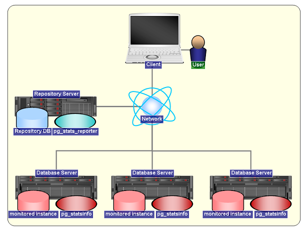

<div class="index">

1.  [What is pg_statsinfo?](#What-is-pg_statsinfo)
2.  [Description](#Description)
    1.  [Statistics Snapshot](#Statistics-Snapshot)
    2.  [Server Log Filter](#Server-Log-Filter)
    3.  [Server Log Accumulation](#Server-Log-Accumulation)
    4.  [Alert Function](#Alert-Function)
    5.  [Command Line Operations](#Command-Line-Operations)
    6.  [Automatic Repository Maintenance](#Automatic-Repository-Maintenance)
3.  [Install](#Install)
    1.  [Requirement](#Requirement)
    2.  [Installation](#Installation)
4.  [Administrative Operations and Settings Detailed](#Administrative-Operations-and-Settings-Detailed)
    1.  [Starting and Stopping pg_statsinfo](#Starting-and-Stopping-pg_statsinfo)
    2.  [Taking Snapshots and Deleting Old Snapshots](#Taking-Snapshots-and-Deleting-Old-Snapshots)
    3.  [Distributing Server Log](#Distributing-Server-Log)
    4.  [Server Log Accumulation Into Repository](#Server-Log-Accumulation-Into-Repository)
    5.  [Alert Function](#Alert-Function)
    6.  [Getting Textual Reports by Command Line Operation](#Getting-Textual-Reports-by-Command-Line-Operation)
    7.  [Automatic Maintenance](#Automatic-Maintenance)
    8.  [Disable collect of column information and index information](#disable-collect-of-column-information-and-index-information)
    9.  [Configuration File](#Configuration-File)
5.  [Uninstallation](#Uninstallation)
6.  [Restrictions](#restrictions)
7.  [Q&A](#qa)
8.  [Changes From pg_statsinfo16](#changes-from-pg_statsinfo16)
9.  [Detailed Information](#Detailed-Information)
    1.  [Sharing Repository Database](#Sharing-Repository-Database)
    2.  [Fall-Back Mode](#Fall-Back-Mode)
    3.  [Internals](#Internals)
    4.  [Distributing server log](#Distributing-server-log)
10. [See Also](#see-also)

</div>

# pg_statsinfo 17

## What is pg_statsinfo

pg_statsinfo is a monitoring tool to record activities and statistics
of PostgreSQL server in the form of time series of snapshots. You can
examine the snapshots on graphical representations by using
[pg_stats_reporter](https://github.com/ossc-db/pg_stats_reporter).

pg_statsinfo 14 and later are available on GitHub. pg_statsinfo 13 and earlier can be found at [SourceForge](https://pgstatsinfo.sourceforge.net/index.html).

## Description

pg_statsinfo periodically gathers activities and statistics of one or
more PostgreSQL servers and packing them as a snapshot. Snapshots are
stored into *repository* database on another or same PostgreSQL server.
Besides, it picks up some activities from PostgreSQL's CSV format log
files and generates corresponding plain log files including its
distinctive messages.

Two or more PostgreSQL *instances* can share single repository database.

You can check for server health and activities in easy-to-grasp
graphical representation by using
[pg_stats_reporter](https://github.com/ossc-db/pg_stats_reporter).
It shows various information as interactive tables and graphs.

Components of pg_statsinfo are typically placed as the picture below.
Each pg_statsinfo collects the information of the *Database Server*
where it resides on and sends snapshots to the *Repository Server*.
[pg_stats_reporter](https://github.com/ossc-db/pg_stats_reporter)
runs behind web server so that the Users can get graphical reports on
web browser on the *Client*.

<div class="imagebox">



pic 1: Example system configuration with pg_statsinfo

</div>

<div class="imagebox">


pic 2: Functional components in pg_statsinfo

</div>

### Statistics Snapshot

pg_statsinfo periodically gathers various information and stores them
as snapshots into a repository database. The repository database may
reside on one of the monitored PostgreSQL server (DB cluster) and one
repository server can store snapshots from multiple servers. Snapshots
are generated for every 10 minutes as default and when commanded
manually.

#### Statistics that can be taken with a snapshot

Every snapshots holds the following information:

  - All of the information collected by [the statistics
    collector](https://www.postgresql.org/docs/17/static/monitoring-stats.html).
    For example, numbers of INSERT/UPDATE/DELETEs and buffer access
    counters.
  - Disk usage per tablespace, WAL, and archive log directory.
  - Long transactions and their query strings.
  - Session state statistics.
  - WAL write rate and time required to write.
  - Number of CHECKPOINTs ,VACUUMs, and their execution time and buffer
    access statistics.
  - Long queries and execution statistics on queries, functions, OS resource information, wait events (top 10), and planning time.
  - PostgreSQL configuration parameters.
  - OS resource information. (CPU usage, memory usage, disk I/O, load
    average)
  - Long lock conflicts.
  - Number of query cancellations caused by conflict with recovery.
  - Streaming replication status.
  - Logical replication status.
  - Alert messages emitted by user-defined alert function.
  - Profiling information using SystemTap (experimental).
  - Wait events per instance.

The required storage for every snapshot depends on the numbers of
objects in the monitored database. It occupies about 800 - 1000kB in
typical cases. pg_statsinfo takes snapshots for every 10 minutes by
default, so the required storage for all snapshots in a day from every
monitored database is roughly estimated to be 120 - 150MB.

You can see the structure of the tables in pg_statsinfo's repository
database in [this](files/pg_statsinfo_v17_repository_infomation.xls)
document. (MS Excel document in Japanese).

### Server Log Filter

pg_statsinfo distributes server log entries according to message
levels. CSV log, plain text log, and syslog can have their own threshold
levels.

  - The file for text plain logs that pg_statsinfo writes have its
    unique and static name defaulted to pg_statsinfo.log. Fixed file
    name let log monitoring tools read the latest log file with easy
    setup.
  - The text plain log file can have permissions other than 0600, it
    might allow more flexible operations.
  - Log levels of each log entry can be altered in the plain the text
    log file. Changing ERROR messages which have no harm to operations
    into INFO would silence monitoring system.
  - Log entries can be kept from appearing in the plain text logs. For
    example, log entries for some user can be filtered out.

### Server Log Accumulation

pg_statsinfo can store server logs into repository database besides log
files.

  - Log entries to be stored can be limited by error levels.
  - Also can be limited by user names
  - Error levels can be altered in repository in similar way to log
    files.

### Alert Function

pg_statsinfo has an alert function which checks for some properties
being out of acceptable range. It writes alert logs into text log file
and repository if set up to do so, but not to CSV log file.

The default alert function checks for the following properties:

  - Rollbacks per seconds
  - Commits per seconds
  - Dead space size (MB)
  - Dead space ratio in whole instance (%)
  - Dead space ratio of each table (%)
  - Average query response time (sec)
  - Longest query response time (sec)
  - Correlations of each table<sup>(\*1)</sup> (%)
  - Maximum number of backends
  - Empty disk space in table space (%)
  - Load average
  - Swap usage (KB)
  - Replication delay (MB)

(\*1) Table correlation is monitored only for *clustered* tables, which
are the tables having clustering index.

The contents of alert message of each alert item is shown in 
["report item list of pg_statsinfo v17".](files/pg_statsinfo_v17_report_infomation.xls)
(.xls in Japanese).

You can see setup instructions [here](#Alert-Function).

### Command line operations

pg_statsinfo has some functions which could be done in command line.
Besides, you can get textual reports by command line operations.  
\* You can see the reference in [this section](#Getting-Textual-Reports-by-Command-Line-Operation).

#### Reporting in command line

You can get a report for the snapshots of a particular period in text
format. Following kinds of information are available.

  - Snapshot list
  - Total disk usage for snapshots

The comprehensive list of report items is shown in 
["report item list of pg_statsinfo v17".](files/pg_statsinfo_v17_report_infomation.xls)
(.xls in Japanese)  
Report items are equivalent with
[pg_stats_reporter](https://github.com/ossc-db/pg_stats_reporter).  
If you would like to see graphical reports, please try
[pg_stats_reporter](https://github.com/ossc-db/pg_stats_reporterl).

#### Administrative operations

pg_statsinfo also provide administrative operations on command-line
interface. Command descriptions are below.  

  - Taking a snapshot manually
  - Deleting snapshots from repository
  - Stopping pg_statsinfo agent
  - Starting pg_statsinfo agent

  

### Automatic repository maintenance

pg_statsinfo accumulates snapshots in repository database as it works,
so it is necessary to delete stale snapshots. pg_statsinfo has a
feature to do that once a day automatically. This feature does following
jobs.

  - Deleting snapshots older than the period specified.
  - Deleting old logs in repository.
  - Cleaning up log files

It is defaulted to be turned on and will be executed on preset settings.

The snapshots, stored logs and server logs are keeping to increase while
this feature is turned off. Manual maintenance should be done properly
in the case.  

Setup reference of this feature is [here](#Automatic-Maintenance).

## Install

### Requirement

  - PostgreSQL versions  
    PostgreSQL 17
  - OS  
    RHEL 8.x (x86_64), Rocky Linux 8.x (x86_64)
    RHEL 9.x (x86_64), Rocky Linux 9.x (x86_64)

### Installation

#### Installing using RPM

##### RHEL 8, RHEL 9

The following steps install pg_statsinfo using rpm.

    $ su
    # dnf install pg_statsinfo-17.0-1.rhel8.x86_64.rpm

#### Installing from source

You can build and install pg_statsinfo by following steps using PGXS.
Setting up of repository database will be done automatically at first
run.

    $ cd pg_statsinfo
    $ tar xzvf pg_statsinfo-17.0.tar.gz 
    $ cd pg_statsinfo-17.0
    $ make USE_PGXS=1
    $ su
    # make USE_PGXS=1 install

### Configuration

This section describes the configuration of pg_statsinfo.

#### Configuration in postgresql.conf

This section shows the minimal setting to run pg_statsinfo and setting
for ordinary case. In these configurations, pg_statsinfo stores
snapshots into the 'postgres' database on the same instance to monitored
instance. Detailed explanation for all setting parameters is shown in
[this section](#Configuration-File).

    # minimal configuration
    shared_preload_libraries = 'pg_statsinfo'       # preload pg_statsinfo libraries
    log_filename = 'postgresql-%Y-%m-%d_%H%M%S.log' # pg_statsinfo requires this log_filename setting

    # recommended configuration
    shared_preload_libraries = 'pg_statsinfo'       # preload pg_statsinfo libraries
    
    pg_statsinfo.snapshot_interval = 30min          # snapshot interval 
    pg_statsinfo.enable_maintenance = 'on'          # enable automatic maintenance ('on' or 'off')
    pg_statsinfo.maintenance_time = '00:02:00'      # delete old snapshots every day at this time.
    pg_statsinfo.repolog_min_messages = disable     # disable log accumulation
    log_filename = 'postgresql-%Y-%m-%d_%H%M%S.log' # pg_statsinfo requires this log_filename setting
    log_min_messages = 'log'
    pg_statsinfo.syslog_min_messages = 'error'
    pg_statsinfo.textlog_line_prefix = '%t %p %c-%l %x %q(%u, %d, %r, %a) '
    pg_statsinfo.syslog_line_prefix = '%t %p %c-%l %x %q(%u, %d, %r, %a) '
    
    track_functions = 'all'
    log_checkpoints = on
    log_autovacuum_min_duration = 0
    #pg_statsinfo.long_lock_threshold = 30s        # threshold for getting long lock information

##### Notice for tacitly changed parameters.

  - log_destination  
    Forcibly set to 'csvlog' and stderr is omitted.
  - logging_collector  
    Forcibly set to on.

#### Configuration of pg_hba.conf

Setup to allow the owner of the PostgreSQL process to log in the
PostgreSQL server from localhost without password. "ident" is
recommended method for authentication. In order to do that, add the
following line to
[pg_hba.conf](https://www.postgresql.org/docs/17/static/auth-pg-hba-conf.html)
when "OS-user = DB-superuser = postgres" which is the most common case.
Note that only the first line that matches the condition will be in
effect. The "ident" authentication method with TYPE=local would be
convenient on
    Linux.

    # TYPE  DATABASE        USER            CIDR-ADDRESS            METHOD [for UNIX]
    local   all             postgres                                ident

#### Configuration for involving query statistics

You can have snapshots involving query statistics using
[pg_stat_statements](https://www.postgresql.org/docs/17/static/pgstatstatements.html).
pg_statsinfo automatically detects pg_stat_statements and use it.
Installation of pg_stat_statements would be done in the following
steps after adding it to shared_preload_libraries in postgresql.conf.

    $ psql -d postgres -c "CREATE EXTENSION pg_stat_statements"

You can set the following parameters in postgresql.conf as needed.

  - pg_statsinfo.stat_statements_max
  - pg_statsinfo.stat_statements_exclude_users
  - pg_stat_statements.track_planning

Explanation for these parameters is seen in the
[Configuration](#Configuration-File) section.

#### Collection execution plan statistics

Execution statistics itemized by execution plans are available. By
installing pg_store_plans on the monitored system, pg_statsinfo
collects the execution plan statistics and stores as snapshots.  

The parameters below affect the behavior of this feature.

  - pg_statsinfo.stat_statements_max
  - pg_statsinfo.stat_statements_exclude_users

You can see the details in [Configuration File](#Configuration-File).

pg_stats_reporter requires a SQL function provided by pg_store_plans
so it is required to be installed also on repository server to show the
plan statistics properly in reports. There's no need to load the library
so shared_preload_libraries may be left untouched.

That's all. Have fun.

## Administrative operations and settings detailed

This section explains about maintenance operations and detailed
description of configuration parameters for pg_statsinfo.

### Starting and Stopping pg_statsinfo

No specific operation is required to run pg_statsinfo on PostgreSQL
startup. Just start the server.

    $ pg_ctl start [OPTIONS]

Likewise, pg_statsinfo stops gracefully along with PostgreSQL's
shutdown. Shutting down in other than smart mode might cause some error
messages, but they do no harm. Just ignore them.

    $ pg_ctl stop -m smart [OPTIONS]

pg_statsinfo can stop individually on running PostgreSQL server by the
following command.

    $ pg_statsinfo --stop [OPTIONS]

Then it starts by the following command.

    $ pg_statsinfo --start [OPTIONS]

**Note: pg_statsinfo should be preloaded or it won't start by any
means.**

### Taking snapshots and deleting old snapshots

#### Automatic snapshots

pg_statsinfo takes snapshots periodically with the interval determined
by pg_statsinfo.snapshot_interval in postgresql.conf.

example: setting snapshot interval time to 30 minutes

    pg_statsinfo.snapshot_interval = 30min 

#### Manual snapshots

Alongside the automatic snapshots, manual snapshots can be taken any
time by the following command. The function statsinfo.snapshot takes the
label for the snapshot as parameter (text DEFAULT NULL).

    $ psql -d postgres -c "SELECT statsinfo.snapshot('comment')"

Manual snapshot is an asynchronous operation so you may find the result
of an operation after a while.

#### Deleting snapshots automatically

Old snapshots are automatically deleted by the automatic repository
maintenance function if tuned on.

Detailed explanation for setting up of the function is shown
[here](#Automatic-Maintenance).

#### Deleting snapshots manually

Snapshots deletion can be executed at any time by the function
statsinfo.maintenance(timestamptz). This function deletes all snapshots
older than the specified timestamp.

Example: Deleting snapshots older than 2014-02-01
    07:00:00.

    $ psql -d postgres -c "SELECT statsinfo.maintenance('2014-02-01 07:00:00'::timestamptz);"

#### Cleaning up log files automatically

Log files are cleaned up along with automatic snapshot deletion.

Detailed explanation for setting up of the function is shown
[here](#Automatic-Maintenance).

### Distributing server log

pg_statsinfo has the function to capture, manipulate, filter and
distribute the server logs from PostgreSQL CSV log files.  
The types of log files that pg_statsinfo handles and methods of
filtering is described below.

#### Types of log files

  - CSV log files (\*.csv) (named like
    postgresql-2013-10-01_000000.csv)  
    CSV log file is the source of the PostgreSQL log messages
    pg_statsinfo processes. (Detailed explanation for CSV log file is
    seen
    [Here](https://www.postgresql.org/docs/17/static/runtime-config-logging.html#RUNTIME-CONFIG-LOGGING-CSVLOG))

  - Text log files (specifically that with the name of
    "pg_statsinfo.log")  
    The log file written by pg_statsinfo is called text log file.
    
    This has the following characteristics.
    
      - Written in arbitrary format specified in configuration.
      - Has any permission specified in configuration. (owner write is
        necessary, of course)
      - Named freely by configuration.
      - Log entries for specific user can be filtered out, by
        configuration.
      - Log levels can be altered for the entries with specified
        SQLSTATE.
    
    Following parameters determine the first three characteristics
    above. (details are [Here](#Configuration-File))
    
      - pg_statsinfo.textlog_line_prefix
      - pg_statsinfo.textlog_permission
      - pg_statsinfo.textlog_filename

  - Preserved text log file (e.g. postgresql-2013-10-01_000000.log)  
    Text log files mentioned above is renamed for preservation. The
    renamed file is created by log rotation.  
    
    Note 1: PostgreSQL may create a file with the new name mentioned
    above, which possibly contains stderr messages originate outside
    PostgreSQL processes. The existing and non-empty "console log" file
    will be renamed before the rotation.
    
    Note 2: Files with extension ".copy" or ".err.*n*" may be created at
    log rotation. In detail [see below](#Distributing-server-log).
    
      
    Following is an example how the rotation looks like.  
    
        $ ls -l $PGDATA/log
        -rw------- 1 postgres postgres 433644 Oct  1 23:59 postgresql-2013-10-01_000000.csv
        -rw------- 1 postgres postgres 322167 Oct  1 23:59 postgresql-2013-10-01_000000.log
        -rw------- 1 postgres postgres 425449 Oct  2 23:59 postgresql-2013-10-02_000000.csv
        -rw------- 1 postgres postgres 321695 Oct  2 23:59 postgresql-2013-10-02_000000.log
        -rw------- 1 postgres postgres 255424 Oct  3 13:40 postgresql-2013-10-03_000000.csv
        -rw------- 1 postgres postgres      0 Oct  3 00:00 postgresql-2013-10-03_000000.log
        -rw------- 1 postgres postgres 190786 Oct  3 13:40 pg_statsinfo.log
        
        postgresql-2013-10-01_000000.csv ... CSV log that has been rotated
        postgresql-2013-10-01_000000.log ... Text log that has been rotated (processed log based on the CSV log above)
        postgresql-2013-10-02_000000.csv ... CSV log that has been rotated
        postgresql-2013-10-02_000000.log ... Text log that has been rotated (processed log based on the CSV log above)
        postgresql-2013-10-03_000000.csv ... Latest CSV log
        postgresql-2013-10-03_000000.log ... Console log
        pg_statsinfo.log ................... Latest Text log (processed log based on the latest CSV log)

#### Filtering types

  - Filter by message level  
    Log messages are filtered out if its log level is lower than a
    threshold which is defined by the following configuration parameter
    in postgresql.conf.
      - pg_statsinfo.textlog_min_messages
    
    For more information about configuration, refer the [Configuration
    File](#Configuration-File) section.
    e.g. Following setup let only log messages whose level is greater
    than or equal to "warning" be emitted.
    
        pg_statsinfo.textlog_min_messages = warning
    
  - Filter by user name  
    Log messages with particular user names can be filtered out.
    The excluding user names are specified by the following
    configuration parameter in postgresql.conf.
      - pg_statsinfo.textlog_nologging_users
    
    For more information about configuration, refer the [Configuration
    File](#Configuration-File) section.
    e.g. Output only log messages with the user name other than
    'postgres'.
    
        pg_statsinfo.textlog_nologging_users = 'postgres'
    
  - Change message level  
    Error level can be reassigned in the log messages with particular
    SQLSTATE codes.
    The replacement rule is defined by the following parameters in
    postgresql.conf. The value for each parameter, if any, should be a
    list of the SQLSTATE codes which determines the log messages whose
    error level should be changed to be the level that the parameter
    name suggests.
      - pg_statsinfo.adjust_log_level
      - pg_statsinfo.adjust_log_info
      - pg_statsinfo.adjust_log_notice
      - pg_statsinfo.adjust_log_warning
      - pg_statsinfo.adjust_log_error
      - pg_statsinfo.adjust_log_log
      - pg_statsinfo.adjust_log_fatal
    
    For more information about configuration, refer the [Configuration
    File](#Configuration-File) section.
    e.g. Changing the message level to 'INFO' for logs with the SQLSTATE of '42P01'.
    
        pg_statsinfo.adjust_log_level = on
        pg_statsinfo.adjust_log_info = '42P01'
    
    Note: This configuration is shared between log file and
    repository-accumulated logs. They cannot have individual settings.

#### Automatic cleanup of log files

pg_statsinfo automatically moves or removes old log files.  
This feature is enabled by default.  
Click [here](#Automatic-Maintenance) for more of the automatic maintenance
feature.

### Server log accumulation into repository

pg_statsinfo also can accumulate logs into repository database.  
The same types of filtering to text log file can be used with partially
different settings.

#### Types of filtering

  - Filter by message level  
    Log messages can be filtered out in the same manner to text log
    file.
    The threshold is specified by the following parameter in
    postgresql.conf.
      - pg_statsinfo.repolog_min_messages
  - Filter by user name  
    User name filtering of log messages is also available.
    The excluding user names are specified by the following parameter in
    postgresql.conf.
      - pg_statsinfo.repolog_nologging_users
  - Change the message level  
    Error level reassignment is also available [as text log
    file.](#adjust-log-level) As mentioned in the section, this feature
    shares the settings with text log files.

#### Deleting old log entries in the repository database

Old log entries in the repository database is deleted by the automatic
maintenance feature.  
This feature is enabled by default.

Click [here](#Automatic-Maintenance) to see how to set up the automatic
maintenance.

#### Prevent accumulation of server log recursively

When all of the following conditions are matched, server log
accumulation is recursively repeated.  
Therefore the server log accumulation becomes to disable forcibly to
prevent this.

  - The repository database is located on the same instance as observed
    database.
  - The database user that use to connect to the repository database is
    non-superuser.
  - log_statements of the repository DB connection is set to "all" or
    "mod".  
    log_statements has role-specific settings apart from the
    configuration file (postgresql.conf).

### Alert Function

Alert function works according to the corresponding row to the observed
instance in the repository table statsrepo.alert. Columns in the row
define the threshold of respective alerting items. Setting -1 silences
the alert.  

The details of the table are shown
below.

| column name           | data type | default value | description                                                                     |
| --------------------- | --------- | ------------- | ------------------------------------------------------------------------------- |
| instid                | bigint    | (no default)  | Instance ID of the instance to be monitored                                     |
| rollback_tps         | bigint    | 100           | Alert threshold: ROLLBACK per second during a snapshot interval                 |
| commit_tps           | bigint    | 1000          | Alert threshold: COMMIT per second during a snapshot interval                   |
| garbage_size         | bigint    | \-1           | Alert threshold: Table dead space size in megabytes in a snapshot               |
| garbage_percent      | integer   | 30            | Alert threshold: Table dead space ratio in %                                    |
| response_avg         | bigint    | 10            | Alert threshold: Query average response time in seconds for a snapshot interval |
| response_worst       | bigint    | 60            | Alert threshold: Query longest response in seconds for a snapshot interval      |
| correlation_percent  | integer   | 70            | Alert threshold: The absolute value of pg_stats.correlation                    |
| backend_max          | integer   | 100           | Alert threshold: Maximum number of backend for a snapshot interval              |
| disk_remain_percent | integer   | 20            | Alert threshold: Available disk space for tablespaces in percent(%)             |
| loadavg_1min         | real      | 7.0           | Alert threshold: Load average for 1 minutes                                     |
| loadavg_5min         | real      | 6.0           | Alert threshold: Load average for 5 minutes                                     |
| loadavg_15min        | real      | 5.0           | Alert threshold: Load average for 15 minutes                                    |
| swap_size            | integer   | 1000000       | Alert threshold: Disk swap usage in kilobytes                                   |
| rep_flush_delay     | integer   | 100           | Alert threshold: Replication delay in megabytes of WAL amount                   |
| rep_replay_delay    | integer   | 200           | Alert threshold: Replication replay delay in megabytes of WAL amount            |
| enable_alert         | boolean   | true          | Setting false disables all alerts on this observed instance.                    |

Example: Set ROLLBACKs threshold to 3000 times per second for a snapshot
interval.

    # UPDATE statsrepo.alert SET commit_tps = 3000 WHERE instid = <instance ID\>

Deleting a row disables all alerts on the corresponding observed
instance. Re-enabling requires inserting a new tuple in the case.

#### Turning on the alert function altogether

The whole alert function is enabled by setting the [GUC
parameter](#Configuration-File) pg_statsinfo.enable_alert. Setting
enable_alert column in the alert configuration table to true allow to get
alerts for the corresponding
    instances.

### Getting textual reports by command line operation

#### Generating a textual report

    $ pg_statsinfo -r REPORTID [-i INSTANCEID] [-b SNAPID] [-e SNAPID] [-B DATE] [-E DATE] [-o FILENAME] [connection-options]

The following example shows a basic usage using the repository database
'postgres' at localhost:5432 accessing as the user 'postgres', which
generates the report that is,

  - All available report items,
  - For the period from the first snapshot to the last snapshot,
  - Of the all monitoring instances,
  - Written to the standard output.

<!-- end list -->

    $ pg_statsinfo  -r All -h localhost -d postgres -p 5432 -U postgres

Available options are described below,

  - \-r, --report=REPORTID  
    Generates a report of the type specified by REPORTID.
    The following REPORTID are available.
    More details are shown in [Items of a report in pg_statsinfo v17](files/pg_statsinfo_v17_report_infomation.xls)
    (Both filename and contents are only in Japanese).
      - Summary
      - Alert
      - DatabaseStatistics
      - InstanceActivity
      - OSResourceUsage
      - DiskUsage
      - LongTransactions
      - NotableTables
      - CheckpointActivity
      - AutovacuumActivity
      - QueryActivity
      - LockConflicts
      - ReplicationActivity
      - SettingParameters
      - SchemaInformation
      - Profiles
      - All
    
    REPORTID will be completed if it matches only one ID by case
    insensitive suffix comparison.
  - \-i, --instid=INSTANCEID  
    Generates a report for the instance specified by INSTANCEID, which
    defaults to all monitoring instances.
  - \-b, --beginid=SNAPID  
    Generates a report for the range begins with SNAPID, which defaults
    to the oldest snapshot for the instance. This option is not allowed
    to be used with -B or -E.
  - \-e, --endid=SNAPID  
    Generates a report for the range ends with SNAPID, which defaults to
    the latest snapshot for the instance. This option is not allowed to
    be used with -B or -E.
  - \-B, --begindate=DATE  
    Generates a report for the period starts at DATE in the format of
    'YYYY-MM-DD HH:MI:SS', which defaults to the timestamp of the oldest
    snapshot for the instance. This option is not allowed to be used
    with -b or -e.
  - \-E, --enddate=DATE  
    Generates a report for the period ends at DATE in the format of
    'YYYY-MM-DD HH:MI:SS', which defaults to the timestamp of the latest
    snapshot for the instance. This option is not allowed to be used
    with -b or -e.
  - \-o, --output=FILENAME  
    Writes the generated report to FILENAME instead of stdout. This will
    overwrites existing file.

  

#### Listing snapshots

    $ pg_statsinfo -l [-i INSTANCEID] [connection-options]

The following example shows the command to list the all snapshots stored
in the repository database 'postgres' at localhost:5432 accessing as the
user 'postgres'.

    $ pg_statsinfo -l -h localhost -d postgres -p 5432 -U postgres

  - \-l, --list  
    Shows the list of snapshots.
  - \-i, --instid=INSTANCEID  
    Shows the snapshot list for the instance INSTANCEID, defaults to all
    instances stored.

  

#### Showing repository database size

    $ pg_statsinfo -s [connection-options]

The following example is the command to show the size of the repository
database 'postgres' at localhost:5432 accessing as the user 'postgres'.

    $ pg_statsinfo -s -h localhost -d postgres -p 5432 -U postgres

  - \-s, --size  
    Shows the repository database size.

  

#### Taking a snapshot manually

    $ pg_statsinfo -S COMMENT [connection-options]

The following example is the command to tell to take a snapshot of the
monitored instance into the repository database 'postgres' at
localhost:5432 accessing as the user 'postgres', providing it with the
comment
    'COMMENT'.

    $ pg_statsinfo -S 'COMMENT' -h localhost -d postgres -p 5432 -U postgres

  - \-S, --snapshot=COMMENT  
    Taking a snapshot manually with the comment 'COMMENT'.

  

#### Deleting snapshot manually

    $ pg_statsinfo -D SNAPID [connection-options]

The following example is the command to tell to delete a snapshot
specified by SNAPID in the repository database 'postgres' at
localhost:5432 accessing as the user 'postgres'.

    $ pg_statsinfo -D 123 -h localhost -d postgres -p 5432 -U postgres

  - \-D, --delete=SNAPID  
    Deletes a snapshot designated by SNAPID.

  

#### Stopping pg_statsinfo agent

    $ pg_statsinfo --stop [connection-options]

The following example is the command to tell pg_statsinfo agent to stop
by connecting the monitored instance via the database 'postgres' of the
user 'postgres' at localhost:5432.

    $ pg_statsinfo --stop -h localhost -d postgres -p 5432 -U postgres

  - \--stop  
    Stops pg_statsinfo agent.

  

#### Starting pg_statsinfo agent.

    $ pg_statsinfo --start [connection-options]

The following example is the command to tell pg_statsinfo agent to
start by connecting the monitored instance via the database 'postgres'
of the user 'postgres' at localhost:5432.

    $ pg_statsinfo --start -h localhost -d postgres -p 5432 -U postgres

  - \--start  
    Starts pg_statsinfo agent.

  

#### Common connection options

This section describes about the connection options of pg_statsinfo
which are common among all subcommands. These options are shared with
PostgreSQL and has the same meanings. The connection target will be a
repository database when the command manipulates snapshots or the
monitored database when the command tells to do something to the agent.

  - \-d, --dbname=DBNAME  
    Name of database to connect to. The default is $PGDATABASE or the
    same name as the connection user name if it is not set.
  - \-h, --host=HOSTNAME  
    Name of the host to connect to. If this begins with a slash, it
    specifies Unix-domain communication rather than TCP/IP
    communication. The default behavior when the host is not specified
    is to connect to a Unix-domain socket in /tmp.
  - \-p, --port=PORT  
    Port number to connect to at the server host.
  - \-U, --username=USERNAME  
    PostgreSQL user name to connect as.
  - \-w, --no-password  
    Never prompt for password.
  - \-W, --password  
    Force password prompt (should happen automatically)

  

### Automatic maintenance

Repository database will piled high with snapshots and log directory
will face the same situation if older data were left being there.
pg_statsinfo deletes them by itself so as not to fill up storage space.
This maintenance is executed once every day and it is set up in
postgresql.conf as follows,

ex 1: Removing snapshots aged more than 7 days at every 0:02 am.

    pg_statsinfo.enable_maintenance = 'snapshot'
    pg_statsinfo.maintenance_time = '00:02:00'
    pg_statsinfo.repository_keepday = 7

ex 2: Removing logs on the repository aged more than 7 days at every
0:02 am.

    pg_statsinfo.enable_maintenance = 'repolog'
    pg_statsinfo.maintenance_time = '00:02:00'
    pg_statsinfo.repository_keepday = 7

ex 3: Archiving CSV logs before the day before at every 0:02
am.

    pg_statsinfo.enable_maintenance = 'log'
    pg_statsinfo.maintenance_time = '00:02:00'
    pg_statsinfo.log_maintenance_command = '<PGHOME>/bin/archive_pglog.sh %l'
    ※<PGHOME>: PostgreSQL install directory

ex 4: Removing both snapshots and logs on the repository aged more than
7 days and archiving and deleting CSV logs before 7 days before.

    pg_statsinfo.enable_maintenance = 'on'
    pg_statsinfo.maintenance_time = '00:02:00'
    pg_statsinfo.repository_keepday = 7
    pg_statsinfo.repolog_keepday = 7
    pg_statsinfo.log_maintenance_command = '<PGHOME>/bin/archive_pglog.sh %l'

Note: All monitored instance sharing one repository database execute
this maintenance for the same repository so the following setting
results in that snapshots aged more than 3 days won't survive after
maintenance process of all instance is finished.

    <Monitoring instance1>
    pg_statsinfo.enable_maintenance = 'snapshot' 
    pg_statsinfo.repository_keepday = 7
    <Monitoring instance2>
    pg_statsinfo.enable_maintenance = 'snapshot' 
    pg_statsinfo.repository_keepday = 5
    <Monitoring instance3>
    pg_statsinfo.enable_maintenance = 'snapshot' 
    pg_statsinfo.repository_keepday = 3

### Disable collect of column information and index information

In an environment with a large number of tables and indexes, bloated snapshot
sizes and delayed taking times can be a problem. By limiting the information
collection target, it is possible to reduce the snapshot size and taking time.

In pg_statsinfo, especially because the column information and index
information of the table often occupy most of the snapshot size, it has
a parameter to disable the collect of column information and 
index information. enable / disable column information collect in
pg_statsinfo.collect_column, and enable / disable index information collect in
pg_statsinfo.collect_index. Both are specified as on / off or true / false, 
and the default is on for both.

However, some report items will not be output. Only use this information if you
determine that it is not needed. For details, see [Config:Items that cannot be reported](#configitems-that-cannot-be-reported)

#### Estimated reduction size

Since one snapshot requires about 350 bytes for each index and about 150 bytes
for each column, these can be reduced as they are if they are not collected. 

However, if the index name or column name is very long, or if you have many
reloptions set for the index, the size per one may be larger than this.

As the number of columns is often larger than the number of tables and indexes,
it tends to be a dominant factor in snapshot size. In the example below,
more than 50% of the snapshot size is column information.

| Schema conditions | Snapshot size | Snapshot size(index part) | Snapshot size(column part) |
|-------------|----------------------|-------------------------------------|---------------------| 
| 1000 tables、1000 indexes、100000 columns (10 columns per table) | 2.8MB | 0.34MB | 1.5MB |
| 10000 tables、10000 indexes、1000000 columns (10 columns per table) | 26MB | 3.3MB | 14.2MB |

### Configuration File

Configuration parameters and their meanings are described below.

pg_statsinfo reads configuration parameters written in postgresql.conf
for the monitored instance. Reloading configuration file of PostgreSQL
also affects
pg_statsinfo.

| Name                       | Setting                                                           | Description                                                                                                                                                                                                                                                                                                     |
| -------------------------- | ----------------------------------------------------------------- | --------------------------------------------------------------------------------------------------------------------------------------------------------------------------------------------------------------------------------------------------------------------------------------------------------------- |
| shared_preload_libraries | 'pg_statsinfo'                                                   | Preloading libraries. This is a parameter not of pg_statsinfo's own but needed in order to run pg_statsinfo.                                                                                                                                                                                                  |
| lc_messages               | C                                                               | Sets the language in which PostgreSQL server log lines are written. This setting is required for pg_statsinfo to parse server logs.                                                                                                                                                                            |
| log_filename              | 'postgresql-%Y-%m-%d_%H%M%S.log'                                 | This is also a PostgreSQL's parameter and must be set for pg_statsinfo so that it runs properly. Log files must be ordered by creation time using alphabetical comparison of file names, so the variable parts "%Y", "%m", "%d", "%H", "%M" and "%S" are all should occur in this order in this format string. |
| track_counts              | on                                                                | Enables collection of statistics on database activity. pg_statsinfo depends on the statistics enabled by this parameter.                                                                                                                                                                                       |
| track_activities          | on                                                                | Enables the collection of information on the currently executing command of each session. pg_statsinfo depends on the information enabled by this parameter.                                                                                                                                                   |
| log_min_messages         | debug5 ∼ log                                                      | Message level threshold for CSV logs. pg_statsinfo uses this as the source of log distribution, so it must be the same or more verbose to the settings of pg_statsinfo.syslog_min_messages, pg_statsinfo.textlog_min_messages and pg_statsinfo.repolog_min_messages.                                  |
| log_destination           | must have 'csvlog' and can have 'syslog' or 'eventlog' optionally | pg_statsinfo needs server logs to be emitted to CSV logs, 'stderr' will be silently removed by pg_statsinfo even if it is occurred.                                                                                                                                                                           |
| logging_collector         | on                                                                | pg_statsinfo always forces this tuned on on startup.                                                                                                                                                                                                                                                           |

Required parameters

Following are PostgreSQL parameters affect the behavior of pg_statsinfo
and pg_statsinfo's dedicated parameters. Changes will be in effect
after reloading configuration file
or restarting the instance (pg_ctl restart).
Notes are added in Description column of table below if restart is necessary.

optional parameters


| Name                                       | Default Setting                            | Description                                                                                                                                                                                                                                                                                                                                     |
|--------------------------------------------|--------------------------------------------|-------------------------------------------------------------------------------------------------------------------------------------------------------------------------------------------------------------------------------------------------------------------------------------------------------------------------------------------------|
| track_functions                            | none                                       | Enables tracking of function call counts and time used. Setting this to 'pl' or 'all' let pg_statsinfo collect call statistics of functions.                                                                                                                                                                                                    |
| track_io_timing                            | off                                        | Enable timing of database I/O calls. Enabling this let pg_statsinfo collect I/O statistics. Note that enabling this may cause significant overhead on some platforms.                                                                                                                                                                           |
| log_checkpoints                            | off                                        | Causes checkpoints to be logged in the server log. Enabling this let pg_statsinfo collect checkpoint activities.                                                                                                                                                                                                                                |
| log_autovacuum_min_duration                | -1                                         | Causes autovacuums to be logged in the server log. Enabling this let pg_statsinfo collect autovacuum activities. Setting to 0 竏ｼ 1min is recommended.                                                                                                                                                                                            |
| log_directory                              | 'log'                                      | Directory location for csvlog and textlog files. pg_statsinfo reads this to know the location of log files.                                                                                                                                                                                                                                     |
| log_rotation_age                           | 1d                                         | Rotates logs in this duration.                                                                                                                                                                                                                                                                                                                  |
| log_rotation_size                          | 10MB                                       | Rotates logs if the size of the current CSV log file exceeds this size.                                                                                                                                                                                                                                                                         |
| syslog_facility                            | 'LOCAL0'                                   | syslog facility when syslog is enabled.                                                                                                                                                                                                                                                                                                         |
| syslog_ident                               | 'postgres'                                 | syslog indent when syslog is enabled                                                                                                                                                                                                                                                                                                            |
| pg_stat_statements.track_planning          | off                                        | Set 'on' to get the plan-generation time in the query statistics (pg_stat_statements).                                                                                                                                                                                                                                                          |
| pg_statsinfo.textlog_min_messages          | warning                                    | Minimum message level for textlog [(*1)](#1_configmessage-levels).                                                                                                                                                                                                                                                                                                         |
| pg_statsinfo.syslog_min_messages           | disable                                    | Minimum message level for syslog [(*1)](#1_configmessage-levels).                                                                                                                                                                                                                                                                                                          |
| pg_statsinfo.textlog_filename              | 'pg_statsinfo.log'                         | Textlog filename. Should not be empty.                                                                                                                                                                                                                                                                                                          |
| pg_statsinfo.textlog_line_prefix           | '%t %p '                                   | A printf-style string that is output at the beginning of each textlog line. [(*2)](#2_configprefix-format)                                                                                                                                                                                                                                                                |
| pg_statsinfo.syslog_line_prefix            | '%t %p '                                   | A printf-style string that is output at the beginning of each syslog line. [(*2)](#2_configprefix-format) Note that timestamp and process ID in syslog are them of pg_statsinfo daemon, not of original ones. You need to add %t and %p to preserve the original values.                                                                                                  |
| pg_statsinfo.textlog_permission            | 0600                                       | Permission mode for textlog file. To use the customary octal format the number must start with a 0 (zero).                                                                                                                                                                                                                                      |
| pg_statsinfo.textlog_nologging_users       | -                                          | Exclude log lines of these users separated by commas from text log .                                                                                                                                                                                                                                                                            |
| pg_statsinfo.repolog_min_messages          | warning                                    | Minimum message levels for repository log [(*1)](#1_configmessage-levels). <br> Log accumulation is recommended to be disabled when the repository is located on the same instance as observed database.                                                                                                                                                                   |
| pg_statsinfo.repolog_nologging_users       | -                                          | Exclude log lines of these users separated by commas from repository log.                                                                                                                                                                                                                                                                       |
| pg_statsinfo.repolog_buffer                | 10000                                      | Since repository logs are sent to repository every 10 seconds by default, pg_statsinfo needs to buffer logs for the intervals. Additionally, this buffer is expected to absorb a transient burst of log entries which might retard storing them. Log entries which are run over this buffer are simply dropped off.                             |
| pg_statsinfo.repolog_interval              | 10s                                        | Repository logs are written at intervals of this value.                                                                                                                                                                                                                                                                                         |
| pg_statsinfo.sampling_interval             | 5s                                         | Sampling is a process collecting some additional information such like session states that is performed several times for a snapshot interval. This value should be far smaller than the snapshot interval [(*3)](#3_configtime-format)                                                                                                                                 |
| pg_statsinfo.snapshot_interval             | 10min                                      | snapshot interval [(*3)](#3_configtime-format)                                                                                                                                                                                                                                                                                                                          |
| pg_statsinfo.excluded_dbnames              | 'template0, template1'                     | Exclude databases listed here from monitoring.                                                                                                                                                                                                                                                                                                  |
| pg_statsinfo.excluded_schemas              | 'pg_catalog, pg_toast, information_schema' | Exclude schemas listed here from monitoring.                                                                                                                                                                                                                                                                                                    |
| pg_statsinfo.repository_server             | 'dbname=postgres'                          | Connection string to connect the repository [(*4)](#4_configconnection-string). Password prompt must be avoided.                                                                                                                                                                                                                                                              |
| pg_statsinfo.adjust_log_level              | off                                        | Enables or disables log level altering feature.                                                                                                                                                                                                                                                                                                 |
| pg_statsinfo.adjust_log_info               | -                                          | A comma-separated list of SQLSTATE codes[(*5)](#5_configsqlstate) specifying messages to change loglevel to INFO.                                                                                                                                                                                                                                                |
| pg_statsinfo.adjust_log_notice             | -                                          | Ditto but changes to NOTICE.                                                                                                                                                                                                                                                                                                                    |
| pg_statsinfo.adjust_log_warning            | -                                          | Ditto but changes to WARNING.                                                                                                                                                                                                                                                                                                                   |
| pg_statsinfo.adjust_log_error              | -                                          | Ditto but changes to ERROR.                                                                                                                                                                                                                                                                                                                     |
| pg_statsinfo.adjust_log_log                | -                                          | Ditto but changes to LOG.                                                                                                                                                                                                                                                                                                                       |
| pg_statsinfo.adjust_log_fatal              | -                                          | Ditto but changes to FATAL.                                                                                                                                                                                                                                                                                                                     |
| pg_statsinfo.enable_maintenance            | 'on'                                       | Enable or disable auto maintenance features. Multiple items should be comma separated. <br> - 'snapshot': Enables only snapshot maintenance. <br> - 'repolog': Enables only repository log maintenance. <br> - 'log': Enables only log file maintenance. <br> - 'snapshot, log': Enables both snapshot and log file maintenance.  <br> - 'on': Enables all maintenance features. <br> - 'off': Disables everything.  |
| pg_statsinfo.maintenance_time              | '00:02:00'                                 | Time to do automatic maintenance.                                                                                                                                                                                                                                                                                                               |
| pg_statsinfo.repository_keepday            | 7                                          | Snapshots are preserved for this period.                                                                                                                                                                                                                                                                                                        |
| pg_statsinfo.repolog_keepday               | 7                                          | Repository logs are preserved for this period.                                                                                                                                                                                                                                                                                                  |
| pg_statsinfo.log_maintenance_command       | \<PGHOME\>/bin/archive_pglog.sh %l         | Command path to be executed to do log file maintenance. Default value is a ready-made shell script which archives old log files into compressed files then removes them.                                                                                                                                                                        |
| pg_statsinfo.long_lock_threshold           | 30s                                        | Time to wait before record prolonged locks.                                                                                                                                                                                                                                                                                                     |
| pg_statsinfo.stat_statements_max           | 30                                         | Maximum number of entries for both of pg_stat_statements and pg_store_plans to be recorded on every snapshot.                                                                                                                                                                                                                                   |
| pg_statsinfo.stat_statements_exclude_users | -                                          | Name of users in comma-separated list whose queries in pg_stat_statements and pg_store_plans are not recorded.                                                                                                                                                                                                                                  |
| pg_statsinfo.long_transaction_max | 10                                          | Maximum number of collected records of long transaction information. Restarting PostgreSQL is needed if this parameter has been changed.  |
| pg_statsinfo.controlfile_fsync_interval    | 1min                                       | Interval to sync pg_statsinfo's control file.                                                                                                                                                                                                                                                                                                   |
| pg_statsinfo.enable_alert                  | off                                         | Off disables all alerts for this instance.                                                                                                                                                                                                                                                                                                      |
| pg_statsinfo.target_server                 | -                                          | Connection string for the observed instance. [(*4)](#4_configconnection-string) pg_statsinfo requires a connection to the observed instance to collect status values. By default, the connection is made to the default database using OS username. This parameter offers more flexible connection settings. Make sure to use a superuser of the database for the connection. |
| pg_statsinfo.rusage_max                   | 5000                                          | Maximum number of entries for resource usage of each queries. It's recommended to set the same value as pg_stat_statements.max. Restart of PostgreSQL is required to change this parameter. |
| pg_statsinfo.rusage_track                 | top                                         | This controls which statements are counted by the tool. Specify top to track top-level statements (those issued directly by clients), all to also track nested statements (such as statements invoked within functions), or none to disable statement statistics collection. |
| pg_statsinfo.rusage_track_utility         | off                                          | Enable or disable track resource usage of utility commands such like COPY.This paramter works when rusage_track is set to on.[(*6)](#6_configrusage_track_utility) |
| pg_statsinfo.rusage_track_planning         | off                                          | Enable or disable track resource usage of planning phase of each queries.This paramter works when rusage_track is set to on. |
| pg_statsinfo.rusage_save         | on                                          | Enable or disable save resource usage of each queries. When it's set to on, resource info could be kept across PostgreSQL stops and starts. |
| pg_statsinfo.wait_sampling_max         | 25000                                          | Maximum number of entries for wait events. It's recommended to set the same value as pg_stat_statements.max * 10. Restart of PostgreSQL is required to change this parameter.  |
| pg_statsinfo.wait_sampling_queries         | on                                          | Enable or disable add queryid to each wait events. |
| pg_statsinfo.wait_sampling_save         | on                                          | Enable or disable save wait events. When it's set to on, wait events info could be kept across PostgreSQL stops and starts. |
| pg_statsinfo.wait_sampling_interval         | 10ms                                          | Period for collecting wat events. (milliseconds) [(*7)](#7_configtime-format-millisecond) |
| pg_statsinfo.collect_column         | on                                          | Enable or disable collect column info at retrieving a snapshot. When it's set to off, column information will not be collected and the snapshot size can be reduced, but some information will not be reported.[(*8)](#8_configitems-that-cannot-be-reported)  |
| pg_statsinfo.collect_index         | on                                          | Enable or disable collect index info at retrieving a snapshot. When it's set to off, index information will not be collected and the snapshot size can be reduced, but some information will not be reported.[(*8)](#8_configitems-that-cannot-be-reported)  |

  - ##### 1_Config:Message Levels  
    The following values are available for a message level. Messages
    with the specified level or more severe level are recorded in the
    logs. "disable" discards all log entries. Severity order is the same
    as
    [log_min_messages](https://www.postgresql.org/docs/17/static/runtime-config-logging.html#RUNTIME-CONFIG-LOGGING-WHEN)
    except additional levels "disable", "alert" and "debug". That is,
    disable \> alert \> panic \> fatal \> log \> error \> warning \>
    notice \> info \> debug
  - ##### 2_Config:Prefix Format  
    Same format with configuration parameter
    [log_line_prefix](https://www.postgresql.org/docs/17/static/runtime-config-logging.html#GUC-LOG-LINE-PREFIX).
    Note that log_line_prefix itself is ignored when pg_statsinfo is
    enabled.
  - ##### 3_Config:Time Format  
    Available units are d (day), h (hour), min (minute), and s (second).
    If not suffixed by any unit, the value will be interpreted in
    seconds.
  - ##### 4_Config:Connection String  
    A keyword/value style connection string. For example,
    'hostaddr=127.0.0.1 port=5432 dbname=mydb user=postgres'. See also
    PQconnectdb in "[Database Connection Control
    Functions](https://www.postgresql.org/docs/17/static/libpq-connect.html)"
    for details. [environment
    variables](https://www.postgresql.org/docs/17/static/libpq-envars.html)
    describes the effect of environment variables.
    Password prompt should be avoided on connecting to the repository.
    Use
    [.pgpass](https://www.postgresql.org/docs/17/static/libpq-pgpass.html)
    file for providing passwords if needed. Note that hostaddr is taken
    as a host name when host is omitted in a connection string. See
    ["Parameter
    Keywords"](https://www.postgresql.org/docs/17/static/libpq-connect.html#LIBPQ-PARAMKEYWORDS)
    for the details.
  - ##### 5_Config:SQLSTATE  
    An SQLSTATE is a five-digit code looks like '42P01' defined in the
    SQL standard. Multiple SQLSTATE codes can be specified here by
    separating with commas like '42P01,42P02'.
  - ##### 6_Config:rusage_track_utility
    If enable pg_stat_statements by setting it in shared_preload_libraries and want to enable this parameter, please specify pg_stat_statements first (on the left side), as 'pg_stat_statements, pg_statsinfo'. Otherwise, the WARINING log will be recorded and rusage_track_utility will be forced to be set to off.
  - ##### 7_Config:Time Format Millisecond
    Available units are d (day), h (hour), min (minute), s (second), and ms (millisecond).
    If not suffixed by any unit, the value will be interpreted in
    milliseconds.
  - ##### 8_Config:Items that cannot be reported
    If collect_column is turned off, all items in "Correlation" in "Notable Tables", "Logical Pages" and "Logical Page Ratio (%)" in "Low Density Tables" in "Notable Tables", and "Columns" in "Tables" in "Schema Information" are not able to be reported.
    If collect_index is turned off, all items in "Correlation" in "Notable Tables" and all items in "Indexes" in "Schema Information" will not be able to be reported.

#### Reloading configuration for pg_statsinfo

pg_statsinfo shares the PostgreSQL's postgresql.conf as its
configuration file. Simply reloading configuration on PostgreSQL where
pg_statsinfo resides on also reloads its configurations.

    $ pg_ctl reload

#### Abnormal termination of pg_statsinfo

pg_statsinfo doesn't involve PostgreSQL in its crash but it won't
restart automatically. Manually start the agent will help.

#### Removing specific instances from repository

pg_statsinfo doesn't remove the data of no-longer-monitored instance
automatically. Manually deleting corresponding records in
statsrepo.instance removes all the data of the instance from
    repository.

    $ psql -d postgres -c "DELETE FROM statsrepo.instance WHERE instid = <instance ID to delete>"

### Uninstallation

When you uninstall pg_statsinfo, you have to restart PostgreSQL server
after removing 'pg_statsinfo' from `shared_preload_libraries` and all
of `pg_statsinfo.*` parameters in postgresql.conf.

After that, drop all objects created for pg_statsinfo in the monitored
instance. $PGSHARE/contrib/uninstall_pg_statsinfo.sql will do it. The
following command will remove such objects for 'postgres' database.

    $ psql -d postgres -f $PGSHARE/contrib/uninstall_pg_statsinfo.sql 

Repository database is uninstalled by running the script
uninstall_pg_statsrepo.sql. Make sure that no other monitored
instances are using the same repository
    database.

    $ psql -d <repository> -f $PGSHARE/contrib/uninstall_pg_statsrepo.sql 

## Restrictions

There are still some restrictions and limitations in pg_statsinfo.

  - Restrictions for log_filename  
    pg_statsinfo expects log_filename that alphabetical sort makes
    them ordered in creation time.

  - Restrictions for pg_statsinfo.textlog_filename  
    This is mandatory and cannot have variable part.

  - Unavoidable error messages might occur in fast or immediate
    shutdown  
    Fast or immediate shutdown breaks pg_statsinfo's own connection
    unexpectedly. It does no harm in spite of some error messages.

  - Shutdown checkpoint cannot be recorded in repository if it shares
    monitored instance.  
    Shutdown checkpoint cannot be recorded in this configuration because
    the repository database has been shutdown before pg_statsinfo
    detects it.

  - Snapshots taken during repository maintenance would fail once.  
    Repository maintenance takes exclusive locks which prevents
    snapshots from being recorded. The snapshots failed to be stored
    will be retried soon.

  - Limitation on multi-instance configuration  
    Monitored instance are distinguished by the combination of database
    system identifier, host name and waiting port number, so
    pg_statsinfo get confused if any two instances share the same
    values for them.

  - Note about auto maintenance of shared repository  
    As described above, the shortest setting will be in effect finally
    if multiple monitored instances sharing one repository database have
    different preserving periods for auto maintenance.

  - Limitation for WAL statistics  
    WAL amount is not available on standby server so you will see WAL
    statistics only on master side.

  - Rounding off of sub-integer values  
    Values represented in integer format may be rounded off to be zero
    for sub-integer values.

  - Log accumulation in repository can go behind  
    Log accumulation can be retarded from some reasons. Manually
    deletion of the CSV log files in the case results in loss of the log
    entries in the deleted files but not-yet-stored in the repository.

  - Connection to repository as a non-superuser.  
    If you want to connect to repository database as a non-superuser,
    make sure that the user has required privileges. The recommended way
    to accomplish this is creating repository database specifying its
    owner to be that user. Following steps would do that.
    
        $ createuser -DRSl -U <superuser> <connection user>
        $ createdb -U <superuser> -O <connection user> <repository database>

  - log_timezone that differs from system time zone  
    pg_statsinfo uses system time zone which is specified by LC_TIME
    or other means as its working time zone. If it is different from
    log_timezone, log entries that pg_statsinfo generates have
    seemingly shifted timestamp in text log file, and log entries in
    repository will be shown in wrong order.

  - Summertime and switching time zone  
    Switching of summertime and switching time zone to another one
    possibly rewinds the time representation, that is, a part of the
    name of new log file. Note that pg_statsinfo always processes the
    CSV log file with the 'largest' name so the new log file with the
    'older' name will be skipped and its contents will disappear.

  - Storing logs under some time zones  
    Each log entry has a timestamp followed by an abbreviated time zone
    names. This abbreviation may represent two or more time zones so the
    log entries will be stored with unexpected timestamp if the
    abbreviation represents a different time zone from your assumption.
    For example, CST is an abbreviation for time zones with three
    different offsets, which defaultly represents US/Central(CST-6), so
    timestamps of log entries sent from a server where log_timezone is
    China(PRC = CST+8) are wrongly advanced by 14 hours on a repository
    where no additional setup is made about time zone abbreviations. You
    need [additional
    setup](https://www.postgresql.org/docs/17/static/datetime-config-files.html)
    if you get a wrong result as follows on repository database for the
    time zone on your system.

  - Limitation about AUTOVACUUM/AUTOANALYZE information  
    log_min_messages is required to be DEBUG1 or more verbose to
    collect the causal query string of autovacuum/autoanalyze
    cancellation.

  - Put modules in shared_preload_libraries in specific order
    Put pg_stat_statements preceding (left to) pg_statsinfo if using
    both pg_stat_statements and pg_statsinfo, like
    shared_preload_librarites = 'pg_stat_statements, pg_statsinfo'.
    Otherwise, WARNING message like below is emited, 
    and rusage_track_utility is enforced to be off.
     ```
    WARNING:  pg_statsinfo.rusage_track_utility is set to false.
    HINT:  pg_statsinfo must be loaded after pg_stat_statements when enable rusage_track_utility .
    ```

  

## Q\&A

#### Q1. How can I check if pg_statsinfo is working fine?

Take a manual snapshot, then confirm that the snapshot is stored in
repository. The following steps will do.

    $psql -d postgres -c "SELECT statsinfo.snapshot('test')"
    $psql -d postgres -c "SELECT * FROM statsrepo.snapshot WHERE COMMENT = 'test'"

#### Q2. How to utilize the snapshots in repository?

The snapshots in repository can be of course inspected using sql queries
but it needs too much labor for most cases. You can use pg_statsinfo's
command line reporting feature to see them as simple reports in text
format. For those who wants to see them in graphical interface,
[pg_stats_reporter](https://github.com/ossc-db/pg_stats_reporter)
provides sortable tables with pager and manipulative graphs. 

#### Q3. Auto maintenance seems not cleaning up snapshots.

Perhaps it might be misconfigured. Make sure your configuration is
correct. Above all, enable_maintenance should be 'on' or include
'snapshot'.

  - pg_statsinfo.enable_maintenance = 'on'
  - pg_statsinfo.enable_maintenance = 'snapshot'
  - pg_statsinfo.enable_maintenance = 'snapshot, log'

#### Q4. How can I make sure that alert function is working?

Set commit alert threshold to 0, then taking a snapshot manually should
give you a commit count alert message in server log.  

    # UPDATE statsrepo.alert SET enable_alert = true, commit_tps = 0;

Don't forget to restore the setting as before after the check.

#### Q5. How can I upgrade pg_statsinfo from older versions in place?

Sorry but you can't. You should uninstall the older version first, then
install new one. Furthermore, the repository database schema of 10 is
not compatible with the older versions. Please [uninstall](#uninstall)
the old repository, and drop its schema before running new version. Then
restart all the monitored instances.  
  

#### Q6. I got nothing in a textual report.

Two or more snapshots in the repository are required to generate a
report. If there wasn't sufficient snapshots during the specified
period, you will get a report after some waiting.  

#### Q7. Some report items seem to be missing in a textual report.

Some of the report items need additional settings and some others have
restrictions.

  - Query Activity (Functions)  
    Needs track_functions to be set properly in postgresql.conf.
    Make sure it is set to other than 'none'.
  - Query Activity (Statements)  
    Needs pg_stat_statement to be installed.
  - Query Activity (Plans)  
    Needs pg_store_plans to be installed.
  - Autovacuum Activity  
    Needs log_autovacuum_min_duration to be a non-negative value in
    postgresql.conf.
  - Checkpoint Activity  
    Needs log_checkpoints to be 'on' in postgresql.conf.
  - OS Resource Usage (IO Usage)  
    pg_statsinfo reads /proc/diskstats to get the information for
    device informations so this item doesn't contain the information of
    NFS mounted devices.
  - Long Transactions  
    Skipped if no long transaction information found in the snapshots
    for the period.
  - Notable Tables  
    Skipped if no information for such tables found in the snapshots for
    the period.
  - Lock Conflicts  
    Skipped if no lock conflict information found in the snapshots for
    the period.
  - Replication Activity  
    Skipped if no replication activity information found in the
    snapshots for the period.
  - Schema Information  
    Make sure the settings so that all target instances can be connected
    without prompting for password. See
    [here](https://www.postgresql.org/docs/17/static/client-authentication.html)
    for details.
    And make sure that pg_statsinfo.collect_column, pg_statsinfo.collect_index
    are not disabled if some portion of the information (Column of Tables, Indexes)
    are not able to be acquired.

#### Q8. There's no plan statistics in a textual report although pg_store_plans has been installed.

pg_store_plans may be installed in the schema other than "public". You
will find the following lines in server log for the
    case.

    ERROR: pg_statsinfo: query failed: ERROR: relation "pg_store_plans" does not exist

Do DROP EXTENSION, then CREATE EXTENSION again explicitly specifying
public as installation schema in order to fix this.

    CREATE EXTENSION pg_store_plans SCHEMA public;

#### Q9. What is the gaps among snapshots?

An attempt of taking a snapshot will be canceled if the previous
snapshot has not completed. The completion of a snapshot could be
prolonged by Access Exclusive Locks on tables or indexes since it
acquires Access Share Lock on
them.

#### Q10. The master server in a HA cluster is shown as a different instance in reporter after a fail-over.

pg_statsinfo identifies an "instance" by instance-id, which is
generated from hostname, port number and database system ID, which
pg_controldata shows. Among the triplet, the host name of the master
will generally be changed by a fail over so this situation happens.
Currently there is no available means of preventing this occurring.

#### Q11. There's no plan statistics in a textual report although pg_stat_statements has been installed.

pg_stat_statements may be installed in the schema other than "public". You
will find the following lines in server log for the case.

    ERROR: pg_statsinfo: query failed: ERROR: relation "pg_stat_statements" does not exist

Do DROP EXTENSION, then CREATE EXTENSION again explicitly specifying
public as installation schema in order to fix this.

    CREATE EXTENSION pg_stat_statements SCHEMA public;

## Changes from pg_statsinfo16

Following changes have been made after pg_statsinfo 16.

  - Supports PostgreSQL 17 (pg_statsinfo 17 supports only PostgreSQL 17).
  - Some of the statistics collected have been changed.
    - Due to changes to the specifications of PostgreSQL's pg_stat_statements and pg_store_plans, pg_statsinfo now handles statistics on the time spent reading and writing file blocks separately for shared blocks and local blocks.
    - Due to a change in PostgreSQL specifications, the view that provides statistics on backend buffer writes has been changed from pg_stat_bgwriter to pg_stat_io.
      As a result, in this version of pg_statsinfo, the values may differ from those in previous versions.

## Detailed information

More advanced usages and internal structures are explained in the
section.

### Sharing Repository Database

As described above, multiple monitored instances can share single repository database. In order to build such configuration, the repository server should accept connections from the monitored instances without password prompts and the combination of PostgreSQL's system identifier, node name given by uname(2) and PostgreSQL's listen port number should be different from any other monitored instance.


### Fall-Back Mode

pg_statsinfo checks for the validity of repository database at startup
and reloading configuration file and it enters fall-back mode if any
problem found in the repository. Fall-back mode of pg_statsinfo is a
running state that enables only the functions available without
repository access.  

Followings are the lists of what is checked for in repository sanity
check, and what is disabled on fall-back mode.

#### Check items for repository sanity check

  - Connectivity
  - Repository schema version

#### Turned-off functions in fallback mode

  - Statistics snapshots including manual one
  - Server log accumulation
  - Alert function
  - Repository maintenances including manual one

These functions disabled in fallback mode resume working after
restoration. All snapshots, alerts during fallback mode are lost
forever. On the contrary, log accumulation will be continued at the
point of fallback.

#### Recovering from fallback mode

pg_statsinfo recovers automatically from fallback mode due to
connection error. Otherwise, reloading configuration after removing the
cause is needed to recover from fallback.

Usually you can see the cause in log file.  
Followings are the common error messages for fallback.

    # Connection failure
    ERROR:  pg_statsinfo: could not connect to database with "host=192.168.0.1 user=postgres": timeout expired
    LOG:  pg_statsinfo: pg_statsinfo is starting in fallback mode
    
    # Wrong version number of repository database schema
    ERROR:  pg_statsinfo: incompatible statsrepo schema: version mismatch
    LOG:  pg_statsinfo: pg_statsinfo is starting in fallback mode

The ways to recover from common issues are shown below.

Connection failure to repository database

  - Check if the repository database server is running first and start
    it if stopped.
  - Make sure that 'pg_statsinfo.repository_server' is correct and fix
    it if needed then reload.

Version number mismatch of repository schema

  - Just remove the statsrepo schema and run pg_statsinfo then
    repository schema will be automatically built. Otherwise create
    another database and use it as repository database.

Missing XML feature

  - Rebuild PostgreSQL with --with-libxml option and install it.

### Internals

pg_statsinfo consists of a library loaded on PostgreSQL and a daemon
process. Since the daemon is executed implicitly by the library at
server startup, users don't have to execute the daemon explicitly.


### Distributing server log

We will explain how to rotate log when pg_statsinfo distribute server
log. At first, the case files with ".copy" extension is created. After,
the case files with ".err.*n*"is created.

#### The "\*.copy" files in pg_log directory

This file is created to prevent overwriting existing files on a log
rotation. The files of the name are storing some server logs that
doesn't fit csv format such like error messages from restore_command.

#### The "\*.err.*n*" files in pg_log directory

Restarting after a server crash or stopping agent may leave a file of
the name. This occurs when pg_statsinfo could not resume reading the
last \*.csv log file it had processed on stopping, and then
pg_statsinfo renames existing \*.log file corresponding to the CSV log
file with that extension. The content of the CSV file might not be fully
processed for the case.

This file also can be created on starting from a base backup. Removing
the file $PGDATA/pg_statsinfo.control before starting a server prevents
this from occurring for this case.

## See Also

[pg_ctl](https://www.postgresql.org/docs/17/static/app-pg-ctl.html),
[psql](https://www.postgresql.org/docs/17/static/app-psql.html),
[Server Configuration](https://www.postgresql.org/docs/17/static/runtime-config.html),
[The Statistics Collector](https://www.postgresql.org/docs/17/static/monitoring-stats.html),
[System Catalogs](https://www.postgresql.org/docs/17/static/catalogs.html),
[pg_stat_statements](https://www.postgresql.org/docs/17/static/pgstatstatements.html),
[pg_stats_reporter](https://github.com/ossc-db/pg_stats_reporter)

-----

<div class="navigation">

[Top](https://github.com/ossc-db/pg_statsinfo)

<div>

Copyright (c) 2009-2025, NIPPON TELEGRAPH AND TELEPHONE CORPORATION

</div>

</div>
